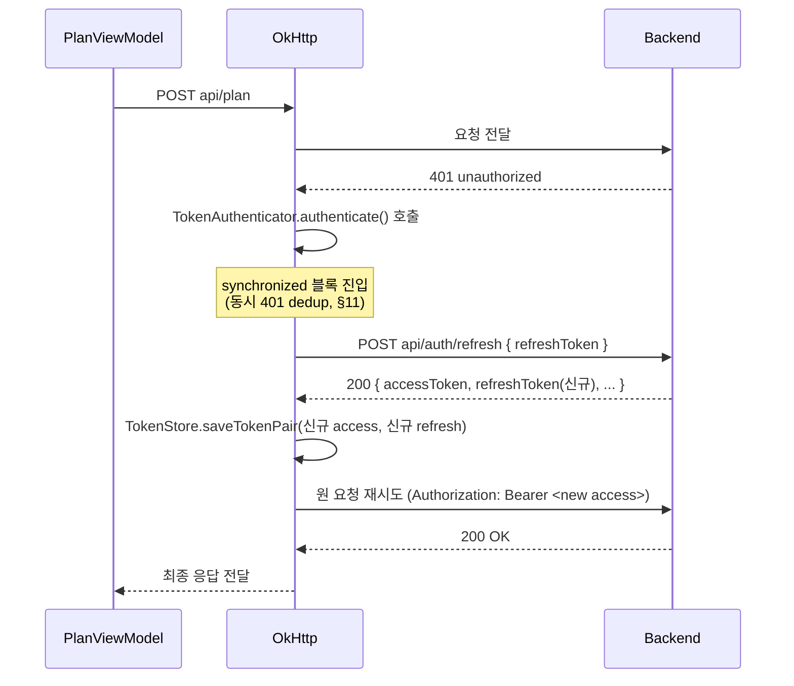

# Android 로그인 + JWT Refresh 인증 설계서

- 대상 프로젝트: `/Users/kimseongjin/Desktop/workspace/private-agent`
- 작성 기준 시점: 2026-08-12
- 성격: **설계 문서만**. 이번 작업에서 Android/iOS/백엔드 코드, Gradle 설정, 테스트 파일, 기존 문서는 일절 수정하지 않았다.
- 목적: 이후 로그인 + Refresh Feature 구현 시 반복 조사 없이 참조할 단일 기준 문서.

### 개정 사항 (2026-08-12, 2차 확정)

1. **minSdk 27 확정** — 현재 프로젝트 설정(`app/build.gradle.kts:17`)과 이미 일치하므로 변경 불필요. Lollipop(API 21/22) 호환 설계·하위 버전 분기는 고려하지 않는다.
2. **사용자 직접 로그아웃은 이번 Feature 범위에서 제외** — 로그아웃 UI, `POST /api/auth/logout` 호출, 관련 신규·수정 파일·구현 단계·테스트 항목을 모두 제거했다. 백엔드에 로그아웃 API가 존재한다는 사실은 §3.3에 규격으로만 기록하고 후속 Feature로 표시한다.
3. **`GET /api/auth/me`는 이번 Feature 범위에서 제외** — 규격은 §3.4에 기록하되 `AuthApi`/DTO/구현 단계에는 포함하지 않는다.
4. **Refresh 거절에 따른 자동 로그아웃은 필수로 유지** — 로컬 토큰 쌍 삭제, 인증 상태를 비인증으로 전환, 원 요청 재시도 중단, 로그인 화면 이동, Back Stack에서 기존 메인 화면 제거를 모두 포함한다. 이 흐름은 `POST /api/auth/logout`을 호출하지 않는다(§12.3, §13.6).
5. **Refresh 오류 처리 정책을 iOS 실제 구현 기준으로 재정렬** — Android가 독자적으로 세분화했던 분류를 iOS `AuthState.performRefresh()`(`AuthState.swift:90-126`)의 실제 3분기(success/unauthorized/networkFailure)에 맞춰 다시 정리했다(§14.1). iOS 코드만으로 확정할 수 없는 항목은 "확인 필요"로 표시했다.

---

## 1. 설계 목적과 범위

기존 `LoginActivity`의 로그인 화면에 백엔드 `private-agent-backend`의 실제 인증 API를 연결하고, 다음 인증 수명주기를 Android 구조에 맞게 설계한다.

로그인 → Access/Refresh Token 저장 → 인증 헤더 자동 적용 → Access Token 만료 시 Refresh → 동시 401 처리 → Refresh 성공 후 원 요청 재시도 → Refresh 실패 유형별 처리(iOS 기준 정렬) → 앱 재실행 시 인증 상태 복원 → **Refresh 거절에 따른 자동 로그아웃(토큰 삭제 + 로그인 화면 복귀)** → 로그인 성공 후 기존 `MainActivity` 이동.

**이번 Feature 범위에서 제외**: 사용자 직접 로그아웃(UI 및 `POST /api/auth/logout` 호출), `GET /api/auth/me` 연동. 두 항목 모두 백엔드 규격 자체는 §3에 기록하되 구현 대상이 아니다.

---

## 2. 확인한 자료와 근거

### Android

- `/Users/kimseongjin/Desktop/workspace/private-agent` 전체 소스, 특히 `LoginActivity.kt`, `MainActivity.kt`, `NetworkModule.kt`, `AgentApi.kt`, `data/repository/*.kt`, `data/remote/dto/*.kt`, `ui/viewmodel/*.kt`, `AndroidManifest.xml`, `app/build.gradle.kts`, `gradle/libs.versions.toml` — 이번 대화 앞부분에서 전체를 직접 읽고 검증함(§5 참고).
- `/Users/kimseongjin/Desktop/workspace/private-agent/docs/architecture/android-project-overview.md` — 기존 분석 문서, 이번 설계의 전제로 재확인.
- `git diff`/`./gradlew :app:compileDebugKotlin`로 현재 빌드 가능 상태까지 재검증 완료(이전 대화에서 처리).

### iOS (별도 조사 에이전트가 실제 파일을 읽고 보고, 아래는 그 결과를 바탕으로 함)

- `/Users/kimseongjin/Desktop/workspace/ios/PrivateAgent/docs/architecture/ios-project-overview.md`
- `/Users/kimseongjin/Desktop/workspace/ios/PrivateAgent/docs/reviews/authentication-ios-review.md`
- `/Users/kimseongjin/Desktop/workspace/ios/PrivateAgent/docs/reviews/authentication-ios-rereview.md`
- **`docs/designs/login-auth.md`는 iOS 저장소에 존재하지 않음.** iOS의 `docs/workflows/authentication-ios-feature.md:47`가 가리키는 `login-auth.md`는 실제로는 **백엔드 저장소**(`private-agent-backend/docs/designs/login-auth.md`) 경로였다 — 요청 프롬프트의 경로 추정이 실제와 달랐던 부분이며, 이 파일 자체는 이번 조사에서 직접 열어보지 않음(백엔드 인증 규격은 실제 코드로 별도 검증했으므로 문제 없음).
- 실제 Swift 소스: `PrivateAgent/view/LoginView.swift`, `PrivateAgent/viewModel/LoginViewModel.swift`, `PrivateAgent/data/local/TokenStore.swift`, `PrivateAgent/viewModel/AuthState.swift`, `PrivateAgent/data/remote/AgentApi.swift`, `PrivateAgent/data/remote/dto/RefreshResponse.swift`, `PrivateAgent/PrivateAgentApp.swift` 등 인증 관련 22개 Swift 파일 전체.

### 백엔드 (별도 조사 에이전트가 실제 코드를 읽고 보고)

- `/Users/kimseongjin/Desktop/workspace/private-agent-backend/docs/api-spec.md`는 **존재하지 않음**. 대신 `docs/backend-api-spec.xlsx`(스프레드시트)와 `docs/review/authentication-review-result.md`, `docs/workflows/features/authentication-backend-*.md`를 문서 근거로 확인.
- **중요: `docs/backend-api-spec.xlsx`와 `README.md:271`은 "인증 API 미구현/Draft"라고 기술하지만, 이는 사실이 아니다.** 실제 코드(`src/routes/auth.js`, `src/controllers/authController.js`, `src/services/authService.js`, `src/middleware/authMiddleware.js`, `src/repositories/userRepository.js`)에는 로그인/리프레시/로그아웃/me API가 완전히 구현되어 있다. 이번 설계는 **문서가 아닌 실제 코드**를 근거로 한다(작업 지시의 "API 명세서와 코드가 다르면 코드 우선" 원칙 적용).

---

## 3. 백엔드 실제 인증 API 규격

Node.js/Express + `jsonwebtoken` + `bcryptjs` + `better-sqlite3` 구조(`private-agent-backend/package.json`). 마운트: `src/index.js:19` → `app.use("/api/auth", authRouter)`, 라우트 정의는 `src/routes/auth.js:7-10`.

### 3.1 로그인 — `POST /api/auth/login`

- 요청 본문: `{ "email": string, "password": string }` (`authController.js:19-24`에서 공백/빈값/이메일 정규식 검증)
- 검증 실패 → **400** `{ "error": "validation_failed", "message": "입력값이 올바르지 않습니다." }`
- 자격 증명 오류(비밀번호 불일치/사용자 없음/비활성 계정 — 모두 동일 코드로 통합, `authService.js:68,75,80`) → **401** `{ "error": "invalid_credentials", "message": "이메일 또는 비밀번호가 올바르지 않습니다." }`
- 성공 → **200**, `authService.js:57-62`(`toAuthResponse`) 기준 평탄한(flat) 구조:
  ```json
  {
    "accessToken": "...",
    "refreshToken": "...",
    "expiresAt": "...",
    "user": { "id": 1, "email": "..." }
  }
  ```
  **`ok` 필드 없음** — 기존 Android가 다루던 `HealthResponse`/`PlanResponse`/`ReviewResponse`의 `ok: Boolean` 관례와 다르다는 점에 주의(§7).

### 3.2 리프레시 — `POST /api/auth/refresh`

- 전달 방식: **JSON 본문의 `refreshToken` 필드**(`authController.js:35`). Authorization 헤더나 Cookie 아님.
- 누락/공백 → **400** `validation_failed`(로그인과 동일 형식)
- 유효하지 않음/만료/이미 폐기/사용자 불일치/비활성 사용자 — 모두 하나로 통합 → **401** `{ "error": "invalid_refresh_token", "message": "세션이 만료되었거나 유효하지 않습니다." }`
- 성공 → **200**, 로그인과 동일 구조(`accessToken/refreshToken/expiresAt/user`).
- **Refresh Token Rotation이 원자적으로 구현되어 있음.** `userRepository.rotateRefreshToken`(`src/repositories/userRepository.js:69-83`)이 `better-sqlite3`의 `db.transaction`으로 "기존 토큰 revoke" + "신규 토큰 insert"를 한 트랜잭션으로 처리 — 중간에 죽어도 "폐기했는데 새 토큰 없음" 상태가 남지 않는다. 이미 폐기된(재사용된) Refresh Token은 `stored.revoked_at` 체크로 거절(401)되며, 전체 세션 강제 폐기(theft-detection cascade) 같은 추가 동작은 없다.

### 3.3 로그아웃 — `POST /api/auth/logout` — **규격만 기록, 이번 Feature 구현 대상 아님**

- 요청 본문: `{ "refreshToken": string }`(필수). **Authorization 헤더는 읽지도 않음** — body의 refreshToken만으로 동작.
- 누락/공백 → **400** `validation_failed`
- 유효하지 않은 토큰 → **401** `{ "error": "unauthorized", "message": "인증이 필요합니다." }` — **주의: 리프레시 실패(`invalid_refresh_token`)와 코드가 다르다.** 유사한 "잘못된 refresh token" 상황인데 엔드포인트마다 에러 코드가 다른 백엔드 쪽 비일관성이다.
- 성공 → **200** `{ "message": "logged_out" }` — 서버 측에서 `revoked_at`을 실제로 세팅해 **진짜로 무효화**한다(단순 클라이언트 폐기가 아님). 단, 이미 발급된 Access Token 자체는 블랙리스트가 없어 자체 만료(15분)까지는 여전히 유효 — 로그아웃은 Refresh Token만 죽인다.

### 3.4 `GET /api/auth/me` — **규격만 기록, 이번 Feature 구현 대상 아님**

`authMiddleware`로 보호되며 `{ "user": { "id", "email" } }`를 반환한다. 이번 로그인+Refresh Feature 범위에서 명시적으로 제외한다 — `AuthApi`/DTO/신규 파일 목록(§17) 어디에도 포함하지 않는다. 향후 별도 Feature로 추가할 경우 §7.3의 "AuthApi 전체는 인증 헤더/401 처리 예외" 규칙을 재설계해야 한다는 점만 참고로 남긴다.

### 3.5 토큰 만료 정책

`src/config/env.js:7-8` — Access Token **15분**(`JWT_ACCESS_EXPIRES_IN` 기본 `"15m"`), Refresh Token **7일**(`JWT_REFRESH_EXPIRES_IN` 기본 `"7d"`), 둘 다 env로 override 가능. Refresh Token도 **서명된 JWT**이며(랜덤 문자열 아님), 서버 DB에는 SHA-256 해시로만 저장된다(`authService.js:26`, `src/db/sqlite.js:32-42`).

### 3.6 인증 미들웨어와 보호 대상 엔드포인트

`src/middleware/authMiddleware.js`(27줄): `Authorization: Bearer <token>` 필수. 헤더 없음/형식 오류/빈 토큰/서명 오류/만료/사용자 비활성 — **모든 실패 사유가 동일한 401** `{ "error": "unauthorized", "message": "인증이 필요합니다." }`로 응답한다. **Android는 이 401만으로 "만료"와 "완전히 무효"를 구분할 수 없다** — 그래서 정책적으로 "일단 Refresh 시도, 실패하면 재로그인"이 유일하게 합리적인 대응이다(§10, §11).

실제로 미들웨어가 걸려 있는 라우트(grep 근거):

| 엔드포인트                                  | 보호 여부        | 근거                                             |
| ------------------------------------------- | ---------------- | ------------------------------------------------ | --- |
| `GET /health`                               | 공개             | `src/routes/health.js`                           |
| `GET /api/ping`                             | 공개             | `src/routes/api.js:5`                            |     |
| `GET /reviewHistory`                        | 보호됨           | `src/routes/reviewHistory.js:5`                  |
| `GET /api/auth/me`                          | 보호됨           | `src/routes/auth.js:10`                          |
| `POST /dev/agent`, `GET /dev/agent/history` | **공개(미보호)** | `src/routes/dev.js`에 `authMiddleware` 참조 없음 |

### 3.7 에러 응답 형식 — API 전역이 통일되어 있지 않음

- `/health` → `{ ok: true, ... }`, `/api/ping` → `{ message: "pong" }`(ok 없음), `/api/ask,/plan,/review`·`/dev/agent` 성공 → `{ ok: true, ... }`, 실패 → `{ error: "<한글 문장>" }`(코드/`message` 필드 없음, `authMiddleware.js:3-4` 주석에 "전역 오류 처리 미들웨어 없음"이라 명시).
- **인증 API(`/api/auth/*`)만 별도 형식**: 성공은 `ok` 필드 없는 평탄 구조, 실패는 `{ "error": "<snake_case 코드>", "message": "<한글 문장>" }`.
- **결론**: Android의 에러 DTO(`AuthErrorResponse`)는 인증 API 전용으로 `{error, message}` 형태로 설계하고, 기존 `PlanResponse`/`ReviewResponse`의 `ok` 기반 처리 방식과 통합하려 하지 않는다(전역 표준화는 백엔드 `README.md:274`에도 "진행 중" 항목으로 명시되어 있어 Android가 임의로 통합할 근거가 없음).

### 3.8 API 명세서(xlsx)와 실제 코드의 차이 (코드 우선)

| 문서 주장                                                                                                           | 실제 코드                                                                                                 | 판정                                                                          |
| ------------------------------------------------------------------------------------------------------------------- | --------------------------------------------------------------------------------------------------------- | ----------------------------------------------------------------------------- |
| 인증 API 미구현/Draft                                                                                               | 완전히 구현되어 라우팅까지 연결됨                                                                         | 문서가 낡음, 코드가 진실                                                      |
| 에러 코드가 `invalid_credentials/invalid_token/token_expired/invalid_refresh_token/refresh_token_revoked` 등 세분화 | 실제로는 `invalid_credentials`, `invalid_refresh_token`, `unauthorized`, `validation_failed` 4종으로 통합 | 세분화된 설계는 구현되지 않음 — Android는 4종 기준으로 설계                   |
| Refresh Token 예시가 임의 문자열(`"random-refresh-token"`)                                                          | 실제로는 서명된 JWT                                                                                       | 예시는 placeholder일 뿐, 포맷은 JWT                                           |
| `/dev/agent`(Agent), `/reviewHistory` 나란히 "보호 대상"으로 계획(`authentication-backend-feature.md:334-356`)      | `/dev/agent`는 실제로 보호 적용 안 됨(의도적 축소, 리뷰 문서 확인)                                        | 계획과 다른 실제 축소 배포 — Android는 오늘 기준 `/dev/agent`를 비보호로 간주 |
| Access 15분/Refresh 7일                                                                                             | 코드 기본값과 일치                                                                                        | 일치                                                                          |
| 에러 응답 예시 문구(`invalid_refresh_token`/`unauthorized` 각각의 메시지)                                           | 코드와 정확히 일치(라이브 테스트 흔적 있음)                                                               | 일치                                                                          |

---

## 4. iOS 인증 구현 요약

iOS 구현은 "사용자 동작·정책 참고용"으로만 사용하고, Swift 타입을 그대로 옮기지 않는다. 아래는 실제 코드 확인 결과다.

- **로그인**: `LoginView.swift` + `LoginViewModel.swift`(`@MainActor final class LoginViewModel: ObservableObject`). `login()`은 최상단에서 `guard !isLoading else { return }`로 중복 제출을 막고, 이메일만 trim(비밀번호는 원본 유지), 실패 시 `AuthAPIError`/`KeychainError`를 사람이 읽을 메시지로 매핑한다(`LoginViewModel.swift:31-60`).
- **토큰 저장**: `TokenStore.swift` — Keychain(`kSecClassGenericPassword`) 래퍼. `saveTokenPair(accessToken:refreshToken:)`가 두 값을 순차 저장하되, **어느 한쪽이라도 실패하면 두 키 모두 삭제 후 원래 에러를 다시 던진다**(부분 저장 롤백, `TokenStore.swift:36-45`) — 이는 코드 리뷰의 Major 이슈(M2)로 지적되어 나중에 고쳐진 것으로, Android의 토큰 쌍 저장 원자성 요구(정책 2/11)와 정확히 같은 문제의식이다.
- **인증 헤더**: 단일 Interceptor가 아니라 `AuthState.authorizedRequest(_:)`(`AuthState.swift:57-75`)라는 상위 함수가 호출자가 넘긴 클로저에 토큰을 주입하는 방식. **다만 이 함수는 현재 어떤 실제 API 호출에도 연결되어 있지 않다** — `getHealth/requestPlan/requestReview`는 여전히 인증 헤더 없이 직접 호출한다.
- **Refresh/401**: `AuthState.performRefresh()`(`AuthState.swift:90-126`)의 실제 분기는 다음 3가지뿐이다(§14.1에서 Android 설계에 그대로 반영).
  1. 저장된 Refresh Token을 읽다가 **예외가 발생**하면 → `.networkFailure`(토큰 유지, 네트워크 호출 안 함).
  2. Refresh Token이 **nil/빈 문자열**이면 → 네트워크 호출 없이 곧바로 `signOut()` + `.unauthorized`.
  3. `agentApi.refreshAccessToken(...)` 호출 결과: 성공 시 `tokenStore.saveTokenPair(...)`를 저장하고, **이 저장 자체가 실패하면 `signOut()` + `.unauthorized`**(새 토큰을 못 지켰으면 인증됐다고 볼 수 없다는 명시적 판단). HTTP 응답이 `AuthAPIError.server`이고 상태 코드가 **정확히 400 또는 401**이면 → `signOut()` + `.unauthorized`. **그 외 모든 경우(다른 4xx, 5xx, 디코딩 실패, 순수 네트워크/타임아웃 오류 등)는 전부 동일하게 `.networkFailure`**(토큰 유지, 이번 요청만 실패)로 처리된다 — iOS는 이 이상으로 세분화하지 않는다.
  - `authorizedRequest`는 원 요청 1회 재시도만 허용.
- **동시성 제어**: `AuthState`가 `@MainActor`이고 `private var refreshTask: Task<RefreshOutcome, Never>?`를 두어, 이미 진행 중인 refresh가 있으면 그 Task를 공유(join)하는 방식으로 "동시 401 → 단일 Refresh"를 구현. 별도 Lock/actor 없이 MainActor 격리에 의존.
- **앱 시작 시 인증 상태**: `PrivateAgentApp.swift`는 `authState.isLoggedIn`을 보고 `LoginView`/`MainView`를 분기하지만, **`AuthState.init()`이 Keychain에 저장된 토큰을 읽어 세션을 복원하는 로직이 없다** — 매번 앱을 새로 켜면 유효한 토큰이 있어도 무조건 로그인 화면부터 시작한다. 이는 iOS 재리뷰 문서에서도 "범위 밖으로 남겨둔 항목"이라고 명시적으로 인정된 미해결 갭이다.
- **로그아웃**: `AuthState.signOut()`은 존재하며(`tokenStore.clear()` + 상태 초기화) `AuthState.performRefresh()`가 명시적 거절(§4 위 3항)을 받을 때 내부적으로 호출된다 — 즉 iOS도 "Refresh 거절 → 로컬 정리 → 비인증 상태"라는 자동 로그아웃 흐름 자체는 갖고 있다. 다만 **사용자가 직접 누르는 로그아웃 버튼은 어떤 화면에도 없다.** `MainView`에는 로그아웃 UI도 `AuthState` 참조도 없고, `signOut()`은 서버 `/api/auth/logout`을 호출하지 않는다 — 이는 Android의 자동 로그아웃 설계(§12.3)와 정확히 같은 전제(로컬 정리만, 서버 로그아웃 API 미호출)이므로 이번 Android 설계도 동일하게 맞춘다.
- **알려진 미해결 이슈**(리뷰 문서 기준): `signOut()`이 `tokenStore.clear()` 실패를 `try?`로 무시(m1, 미해결), `authorizedRequest`가 Keychain 존재 여부만 보고 메모리상 `isLoggedIn` 플래그와 불일치 가능(m2, 미해결). 401→Refresh→재시도 흐름과 동시성 dedup 로직은 **실제 보호된 엔드포인트가 없어 런타임으로 검증된 적이 없다**(정적 코드 리뷰로만 확인됨).

---

## 5. Android 현재 구조와 인증 연결 지점

`docs/architecture/android-project-overview.md`의 분석을 재확인한 결과, 다음은 모두 실제 코드와 일치한다(전제 검증 완료):

- 단일 모듈 Compose 앱, `UI → ViewModel → Repository → AgentApi(Retrofit)` 구조 — 일치.
- DI 프레임워크 없음, `NetworkModule`(`data/network/NetworkModule.kt:12-27`) 싱글턴을 각 ViewModel 생성자에서 직접 참조 — 일치.
- `LoginScreen`(`LoginActivity.kt:58-92`)의 로그인 버튼은 `onLoginClick = { moveToMain() }`(`LoginActivity.kt:41`)로 실제 인증 호출 없이 곧바로 `MainActivity`로 이동 — 일치.
- 인증/토큰 저장/헤더/401 관련 코드 전무 — 재확인 결과도 일치(`grep -rniE "datastore|keystore|token|authenticator|sessionmanager"` 결과 없음).
- Base URL 하드코딩(`data/config/ApiConfig.kt`), 환경 분리 없음 — 일치.
- 요청 객체 전체를 `println`으로 출력하는 패턴(`PlanViewModel.kt:82`, `ReviewViewModel.kt:86`) 존재 — 일치. 로그인 DTO에는 이 패턴을 적용하지 않는다(§15).
- `LoginActivity.kt`에 남아있던 컴파일 위험 코드(`val s1 = input[0]`, `print()`)는 이전 대화에서 이미 삭제·빌드 성공 확인됨 — 더 이상 위험 요소 아님.

---

## 6. Android 인증 아키텍처

```
LoginScreen (Compose)
   │ 입력값 → LoginViewModel.login(email, password)
   ▼
LoginViewModel  ── AuthRepository.login() ──▶ AuthApi.login() [Retrofit]
   │                                              │
   │                                     TokenStore.saveTokenPair(access, refresh)
   │                                              │
   └── SessionManager.onLoginSuccess(user) ◀──────┘
              │ (StateFlow<AuthState> 변경)
              ▼
   LoginActivity가 AuthState 관찰 → LoggedIn이면 moveToMain()

──────────────────────────────────────────────────────────

모든 Retrofit 요청 (PlanViewModel/ReviewViewModel 등, 변경 없음)
   ▼
AuthInterceptor  (AuthApi가 아닌 요청에만 Authorization 헤더 부착)
   ▼
OkHttp 실행 → 401 응답
   ▼
TokenAuthenticator  (동시 401 dedup, 단일 Refresh, 원 요청 1회 재시도)
   │
   ├─ Refresh 성공 → 새 토큰으로 원 요청 재시도
   └─ Refresh 명시적 거절(400/401) → SessionManager.onForcedLogout()
              │
              ▼
   MainActivity가 AuthState 관찰 → LoggedOut이면 LoginActivity로 복귀
```

기존 3계층(`UI → ViewModel → Repository → AgentApi`) 패턴을 그대로 유지하면서, **가로로 관통하는 두 개의 신규 계층**만 추가한다: (1) `TokenStore`/`SessionManager`(인증 상태), (2) `AuthInterceptor`/`TokenAuthenticator`(네트워크 계층 횡단 관심사). Domain Model 계층은 이번에도 도입하지 않는다(기존 프로젝트 컨벤션 유지, §7).

---

## 7. 인증 데이터 모델과 API

### 7.1 DTO 설계

기존 프로젝트 컨벤션(`PlanRequest`/`PlanResponse`, `ReviewRequest`/`ReviewResponse`처럼 엔드포인트별 전용 DTO)을 따라 로그인/리프레시 DTO도 분리한다. iOS도 동일한 이유로 `LoginResponse`/`RefreshResponse`를 구조가 같아도 별도 타입으로 유지했다(리뷰 문서의 m3, "기존 컨벤션과 일관성 있게 유지, 고치지 않음").

```
LoginRequest(email: String, password: String)
LoginResponse(accessToken: String, refreshToken: String, expiresAt: String, user: AuthUser)

RefreshRequest(refreshToken: String)
RefreshResponse(accessToken: String, refreshToken: String, expiresAt: String, user: AuthUser)

AuthUser(id: Int, email: String)          // 로그인/리프레시 공용
AuthErrorResponse(error: String, message: String)   // 인증 API 전용 에러 바디
```

로그아웃(`LogoutRequest`/`LogoutResponse`)과 `/api/auth/me`(`MeResponse`) DTO는 이번 Feature 범위에서 제외한다(§3.3, §3.4) — 만들지 않는다.

모두 `data/remote/dto/`에 `@Serializable data class`로 추가(기존 위치·스타일 그대로).

### 7.2 Domain Model 분리 필요 여부

**분리하지 않는다.** 기존 프로젝트가 DTO를 화면까지 그대로 사용하는 흐름(§ overview 문서 §3)을 따른다. 단, 토큰 문자열 자체(`accessToken`/`refreshToken`)는 UiState에 절대 담지 않고 `TokenStore`에만 존재하도록 경계를 둔다 — 이는 Domain 분리가 아니라 "민감정보를 화면 상태로 노출하지 않는다"는 별도 원칙이다.

### 7.3 인증 전용 Retrofit Service 분리 — `AuthApi` 신설, `AgentApi`는 그대로

기존 `AgentApi`를 확장하지 않고 **별도 `AuthApi` 인터페이스를 신설**한다. 이유:

1. `AgentApi`는 이름 그대로 "Agent 실행/조회" 도메인이고, 인증은 성격이 다른 횡단 관심사다.
2. 더 중요한 이유는 **Interceptor 구현 편의성**이다. Retrofit은 호출된 메서드 정보를 `retrofit2.Invocation`으로 `Request` 태그에 자동으로 실어준다. `AuthInterceptor`/`TokenAuthenticator`가 `request.tag(Invocation::class.java)?.method()?.declaringClass == AuthApi::class.java`인지만 확인하면, **URL 문자열 매칭 없이** "로그인/리프레시 요청에는 인증 헤더를 붙이지 않고, 401이 나도 Refresh를 트리거하지 않는다"는 규칙을 한 줄로 구현할 수 있다. `AgentApi`와 섞으면 메서드 단위 예외 처리가 필요해져 더 복잡해진다.
3. 이번 Feature에서 `AuthApi`는 **로그인/리프레시 2개 메서드만** 포함한다. 로그아웃(§3.3)과 `/api/auth/me`(§3.4)는 범위 제외이므로 넣지 않는다 — 향후 추가한다면 "AuthApi 전체는 인증 헤더/401 처리 예외"라는 위 규칙이 깨지므로(`/me`는 보호된 엔드포인트라 예외 대상이면 안 됨) 그때 예외 목록을 메서드 단위로 재설계해야 한다(§22에 기록).

```
interface AuthApi {
    @POST("api/auth/login")
    suspend fun login(@Body request: LoginRequest): LoginResponse

    @POST("api/auth/refresh")
    suspend fun refresh(@Body request: RefreshRequest): RefreshResponse
}
```

### 7.4 API 호출 책임

`AuthRepository`(신규, `HealthRepository` 스타일의 얇은 래퍼)가 `AuthApi`(로그인/리프레시)를 감싸고, 성공/실패를 그대로 위(ViewModel/TokenAuthenticator)로 전달한다. HTTP 에러 바디(`AuthErrorResponse`) 파싱은 `AuthRepository` 또는 별도의 작은 매퍼 함수(`parseAuthError(HttpException): AuthErrorResponse?`)가 담당해, ViewModel과 `TokenAuthenticator` 양쪽이 동일한 분류 결과를 재사용하게 한다(§14 표와 직결). 로그아웃 API 호출 책임은 이번 Feature에서 부여하지 않는다(§3.3, §12.4).

---

## 8. TokenStore 및 보안 저장소

### 8.1 저장 기술 선택 — `EncryptedSharedPreferences` 권장 (minSdk 27 확정 기준)

**minSdk 27 확정**: 현재 `app/build.gradle.kts:17`의 `minSdk = 27`을 그대로 유지한다(변경 불필요). Lollipop(API 21/22) 호환 설계나 하위 버전 분기는 이번 설계에서 고려하지 않는다. `androidx.security:security-crypto`의 `EncryptedSharedPreferences`/Android Keystore(`AndroidKeyStore` provider)는 API 23부터 안정적으로 지원되므로, minSdk 27은 이 기준을 이미 상회한다 — API 27 기준으로 별도의 하위 호환 분기 없이 설계한다.

| 후보                                                                | 장점                                                                                                                                                                                                                                                                                                   | 단점                                                                                                                                                                                               |
| ------------------------------------------------------------------- | ------------------------------------------------------------------------------------------------------------------------------------------------------------------------------------------------------------------------------------------------------------------------------------------------------ | -------------------------------------------------------------------------------------------------------------------------------------------------------------------------------------------------- |
| **EncryptedSharedPreferences**(`androidx.security:security-crypto`) | Android Keystore 기반 마스터 키로 자동 암호화, API는 동기(`getString`/`edit().putString().apply()`)라 `TokenStore`가 `suspend` 없이도 구현 가능, 신규 의존성 1개만 추가, minSdk 27(§ 위)에서 API 레벨 문제 없음, 기존 Keychain 래퍼(iOS `TokenStore.swift`)와 사용 방식이 가장 유사해 이식 부담이 적음 | Google이 향후 DataStore+수동 암호화 쪽으로 유도 중(공식적으로 대체 API가 아직 확정 안 됨) — §22에 재검토 항목으로 기록                                                                             |
| DataStore(Preferences) + Keystore로 값 직접 암복호화                | 최신 권장 방향, Flow 기반                                                                                                                                                                                                                                                                              | `Cipher`/`KeyStore` 연동 코드를 직접 작성해야 해 이번 Feature 범위 대비 복잡도가 큼, Interceptor가 필요로 하는 "동기 읽기"를 위해 별도 in-memory 캐시를 만들어야 함(DataStore는 suspend/Flow 전용) |
| 평문 SharedPreferences                                              | 가장 단순                                                                                                                                                                                                                                                                                              | 토큰을 평문 저장 — 보안 요구(정책 14 등)에 정면으로 위배, 채택 불가                                                                                                                                |

이번 Feature의 복잡도(단일 모듈, DI 프레임워크 없음, 신규 의존성 최소화 지향)와 보안 요구를 함께 고려해 **EncryptedSharedPreferences를 권장**한다. minSdk 27 확정으로 API 레벨 호환성 우려는 해소됐다(§22의 남은 항목은 `security-crypto` 정확한 버전 핀 정도). 배포 전 보안 강화 단계에서 DataStore+Keystore 전환을 재검토할 것을 §22에 명시한다.

### 8.2 토큰 쌍을 하나의 논리 단위로 다루는 방법

`saveTokenPair(access, refresh)` 단일 메서드만 외부에 노출하고, access/refresh를 개별로 저장하는 메서드는 만들지 않는다. 내부적으로는 `SharedPreferences.Editor`의 `putString(ACCESS,...).putString(REFRESH,...).apply()`를 **한 번의 `edit()` 트랜잭션**으로 묶어(파일 쓰기 자체는 원자적) 이미 상당 부분의 원자성을 확보하고, 그 앞뒤로 Keystore/암호화 계층에서 발생할 수 있는 예외(`GeneralSecurityException`, `IOException`)를 `try/catch`로 감싸 **어느 한쪽이라도 실패하면 두 키를 모두 지우고 예외를 다시 던진다** — iOS `TokenStore.saveTokenPair`(§4)와 동일한 설계 원칙이며, 정책 2/11의 직접적 구현이다.

```
interface TokenStore {
    fun readAccessToken(): String?
    fun readRefreshToken(): String?
    fun saveTokenPair(accessToken: String, refreshToken: String)   // 원자적, 부분 실패 시 롤백
    fun clear()
}
```

`suspend`를 붙이지 않는 이유: EncryptedSharedPreferences의 읽기/쓰기는 이미 동기 호출이고, `AuthInterceptor`/`TokenAuthenticator`(둘 다 OkHttp 콜백 — suspend 컨텍스트 아님)에서 직접 호출해야 하므로 오히려 동기 인터페이스가 더 적합하다. `AuthRepository`/`SessionManager`(코루틴 컨텍스트) 쪽에서는 필요하면 `withContext(Dispatchers.IO)`로 감싸 호출한다.

### 8.3 저장 성공/부분 실패 판단과 실패의 영향

`saveTokenPair`는 성공 시 정상 반환, 실패 시 예외를 던진다(정상/이례 상황을 반환값이 아닌 예외로 구분 — 코틀린 관례). 호출부(`SessionManager`)는 로그인 흐름에서 이 예외를 잡으면 **로그인 상태로 전환하지 않는다**(정책 1과 직결: "두 토큰이 모두 저장된 뒤에만 로그인 상태로 전환"). Refresh 흐름에서 저장 실패가 나면 §14 표의 "새 토큰 쌍 저장 실패" 행을 따른다(기존 토큰까지 폐기 — 서버가 이미 Rotation으로 기존 Refresh Token을 폐기했기 때문).

### 8.4 초기화 위치

`Context`가 필요하므로 신규 `PrivateAgentApplication : Application()`(§9)의 `onCreate()`에서 1회 생성해 싱글턴으로 보관한다(기존 `NetworkModule`의 `object ... by lazy` 스타일과 절충: `TokenStore`는 Context가 있어야 하므로 완전한 `object`로는 만들 수 없고, `Application`이 Composition Root 역할을 한다).

### 8.5 테스트 대체

`TokenStore`를 인터페이스로 정의했으므로, 테스트에서는 `InMemoryTokenStore : TokenStore`(단순 `MutableMap` 기반, 실패를 강제로 유발할 수 있는 플래그 포함)로 교체해 `SessionManager`/`TokenAuthenticator`/`AuthRepository`를 EncryptedSharedPreferences/Keystore 없이 단위 테스트할 수 있다(§19).

---

## 9. 인증 헤더 처리

- **적용 위치**: `NetworkModule.kt`의 `OkHttpClient.Builder()`에 `AuthInterceptor` 추가(`NetworkModule.kt:13-18` 체인 확장). `NetworkModule`은 현재 순수 `object`라 Context가 없으므로, `TokenStore`/`SessionManager`를 주입받을 수 있도록 `NetworkModule.init(tokenStore, sessionManager)` 형태의 1회성 초기화 함수를 추가하는 최소 변경을 가한다(§11 의존성 설계와 연결).
- **인증 필요 요청 구분**: `Invocation.declaringClass != AuthApi::class.java`인 모든 요청에 헤더를 시도(§7.3). `AgentApi`의 `health`(공개)에도 헤더가 붙긴 하지만, 토큰이 없으면 그냥 헤더 없이 통과시키고, 있으면 붙여도 백엔드가 무시하므로 무해하다 — "공개 API는 헤더를 절대 붙이면 안 된다"는 요구가 없는 한 화이트리스트를 따로 관리하지 않아 구현이 단순해진다.
- **로그인/리프레시 제외**: `AuthApi`(로그인/리프레시 2개 메서드, §7.3) 전체가 위 검사로 자동 제외된다(정책 4의 직접 구현). 로그아웃은 이번 Feature에 API 자체가 없으므로 해당 없음.
- **토큰이 없을 때**: 헤더를 붙이지 않고 요청을 그대로 진행한다(요청을 막지 않음). 보호된 엔드포인트라면 백엔드가 401을 반환할 것이고, 그 401은 `TokenAuthenticator`가 처리한다 — "토큰 있는지 미리 판단"과 "401 처리" 로직을 이중으로 두지 않기 위한 의도적 단순화.
- **Authorization 헤더 형식**: `Authorization: Bearer <accessToken>`.
- **기존 헤더가 있을 때**: `request.header("Authorization") == null`일 때만 추가 — 이미 명시적으로 설정된 헤더(현재 코드베이스에는 없지만 향후를 대비)는 덮어쓰지 않는다.
- **로그에 노출되지 않도록**: `AuthInterceptor`/`TokenAuthenticator`는 어떤 상황에서도 헤더 값, 토큰 문자열을 로그로 남기지 않는다(§15). 기존 코드에 이미 `HttpLoggingInterceptor` 자체가 없으므로(§ overview 문서 §5) 신규로 추가하지 않는 한 위험은 낮지만, 만약 디버그 편의를 위해 추가한다면 `Level.BODY`가 아닌 `Level.BASIC` 이하로 제한하고 Authorization 헤더는 마스킹해야 한다는 점을 명시한다.

---

## 10. 401 및 Refresh 처리

### 10.1 401을 처리할 구성요소 — `okhttp3.Authenticator`

Interceptor가 아니라 **`Authenticator`**를 사용한다.

| 비교                    | Interceptor로 401 처리                                           | Authenticator(권장)                                                   |
| ----------------------- | ---------------------------------------------------------------- | --------------------------------------------------------------------- |
| OkHttp 계약             | 모든 요청/응답에 관여, 401만 골라내려면 직접 상태 코드 검사 필요 | 401(또는 407) 응답에서만 자동 호출되는 전용 훅                        |
| 재시도 관리             | 무한 루프 방지를 직접 구현해야 함                                | `response.priorResponse` 체인이 자동 제공되어 재시도 횟수 판별이 쉬움 |
| 이미 재시도한 요청 식별 | 별도 상태 관리 필요                                              | `Response`에서 체인을 역추적하면 됨(아래 §10.4)                       |

Retrofit 3 + OkHttp 조합에서 "401 → Refresh → 재시도"는 정확히 `Authenticator`가 설계된 용도이므로 이를 채택한다. 기존 코드에 `Authenticator` 사용 이력은 없지만(§ overview 문서 §11-12, 미사용 `HttpException` import가 유일한 흔적), `OkHttpClient.Builder().authenticator(...)`로 붙이는 것은 `NetworkModule` 변경만으로 가능해 구조적 부담이 작다.

### 10.2 시퀀스 다이어그램 — 인증 요청과 401, 단일 Refresh, 재시도



### 10.3 Refresh 성공 후 재시도

`Authenticator.authenticate(route, response)`가 새 `Request`를 반환하면 OkHttp가 자동으로 재요청한다. 새 `Request`는 원 요청(`response.request`)을 `newBuilder()`로 복사하고 `Authorization` 헤더만 새 토큰으로 교체해서 만든다(요청 바디 등 나머지는 그대로).

### 10.4 최대 1회 재시도 / 무한 루프 방지

`Authenticator`는 호출될 때마다 이미 몇 번 재시도했는지 스스로 판별해야 한다. `response`에서 `priorResponse`를 따라가며 체인 길이를 세어(의사코드):

```
fun retryCount(response: Response): Int {
    var count = 1
    var prior = response.priorResponse
    while (prior != null) { count++; prior = prior.priorResponse }
    return count
}
```

`retryCount(response) >= 2`(원 요청 1회 + 재시도 1회를 이미 소진)면 `null`을 반환해 OkHttp가 더 이상 재시도하지 않고 원 401을 그대로 호출자에게 전달하게 한다 — 정책 7/8의 직접 구현.

### 10.5 Refresh 자신은 갱신 대상이 되지 않음

`Authenticator.authenticate()` 진입 즉시, 실패한 요청이 `AuthApi`(로그인/리프레시) 호출이었는지 `Invocation` 태그로 검사한다(§9와 동일한 메커니즘). 맞다면 즉시 `null`을 반환해 인증 갱신을 절대 시도하지 않는다 — 이게 없으면 "잘못된 비밀번호로 로그인 시도 → 401 → Authenticator가 Refresh를 시도" 같은 말이 안 되는 흐름이 발생한다(정책 4/설계 문항 §4의 "Refresh 요청이 다시 인증 갱신 대상이 되지 않도록"의 핵심 근거).

### 10.6 Coroutine과 OkHttp 동기 경계

`Authenticator.authenticate()`는 **동기(blocking) 콜백**이며 suspend 함수가 아니다. `AuthRepository.refresh()`는 기존 프로젝트 관례상 `suspend fun`으로 만들어질 것이므로, `Authenticator` 내부에서는 `kotlinx.coroutines.runBlocking { authRepository.refresh(...) }`로 동기 경계를 명시적으로 넘는다. `runBlocking`은 일반적으로 ViewModel/UI 코드에서는 금기지만, OkHttp `Authenticator`는 애초에 별도 디스패처 스레드에서 블로킹 호출을 기대하도록 설계된 API이므로 이 경계 안에서는 정당한 사용이다 — iOS가 `Task`/`async`로 처리한 것과 달리 Android는 OkHttp의 동기 계약에 맞춰 `runBlocking` + `synchronized`를 쓰는 것이 더 관용적이다(§11에서 상세).

### 10.7 Refresh 중 강제 로그아웃/프로세스 종료

이번 Feature에는 사용자 직접 로그아웃이 없으므로(§12.4), 동시성 우려는 "동시에 들어온 두 요청이 모두 401을 받았는데 첫 번째 Refresh가 명시적으로 거절되어 강제 로그아웃이 발생하는" 경우로 좁혀진다.

- **강제 로그아웃과 두 번째 요청의 경합**: 첫 번째 스레드가 `synchronized` 블록(§11.1) 안에서 Refresh를 수행해 `RefreshOutcome.Rejected`를 받으면 `tokenStore.clear()` → `sessionManager.onForcedLogout()`을 호출하고 블록을 빠져나온다. 대기 중이던 두 번째 스레드가 블록에 진입하면 `tokenStore.readAccessToken()`은 이미 `null`이다. §11.1의 분기 조건 `currentToken != null && currentToken != failedToken`이 `currentToken == null`이라 거짓이 되므로, "이미 갱신됨" 경로로 빠지지 않고 **다시 Refresh를 시도**한다 — 하지만 이때 `tokenStore.readRefreshToken()`도 이미 `null`이므로, `AuthRepository.refresh(null)`은 네트워크 호출 없이 곧바로 "Refresh Token 없음" 결과(§14.1 첫 행, iOS의 `.unauthorized`와 동일 분기)를 반환한다. 결과적으로 두 번째 스레드는 중복 네트워크 호출 없이 `sessionManager.onForcedLogout()`을 다시 호출(멱등, 무해)하고 `null`을 반환한다 — 별도의 추가 락 없이 §11.1의 토큰 세대 비교 로직만으로 이 경합이 안전하게 흡수된다.
- **프로세스 종료**: Refresh 네트워크 호출이나 저장 도중 프로세스가 죽으면, 다음 실행 시 §13의 "앱 시작 시 상태 복원" 로직이 `TokenStore`에 남아있는 값(구 토큰이거나, 저장 도중 죽었다면 `saveTokenPair`의 롤백 덕분에 아예 없는 상태)을 기준으로 재판단한다 — 별도의 "중단된 Refresh" 복구 로직은 필요 없다(TokenStore 원자성이 이미 이 문제를 흡수한다).

---

## 11. 동시 Refresh 제어

### 11.1 메커니즘 — `synchronized` + 토큰 세대 비교 (Mutex/Deferred 대신)

`Mutex`(`kotlinx.coroutines.sync.Mutex`)도 고려했으나, `Mutex.lock()` 자체가 suspend 함수라 결국 `Authenticator`의 동기 콜백 안에서는 `runBlocking`으로 감싸야 하므로 순수 JVM `synchronized`/`ReentrantLock` 대비 이점이 없다. OkHttp `Authenticator`는 여러 요청이 동시에 401을 받으면 **OkHttp가 이미 내부적으로 스레드마다 개별 호출**하므로, 다음과 같은 "토큰 세대 비교" 패턴(OkHttp 공식 권장 관용구와 동일한 발상)을 사용한다:

```
class TokenAuthenticator(
    private val tokenStore: TokenStore,
    private val authRepository: AuthRepository,
    private val sessionManager: SessionManager
) : Authenticator {
    private val lock = Any()

    override fun authenticate(route: Route?, response: Response): Request? {
        if (isAuthEndpoint(response.request)) return null       // §10.5
        if (retryCount(response) >= 2) return null              // §10.4

        synchronized(lock) {
            val failedToken = bearerTokenOf(response.request)
            val currentToken = tokenStore.readAccessToken()

            // 이미 다른 스레드가 갱신을 마친 경우: 새 토큰으로 즉시 재시도, Refresh 재호출 없음
            if (currentToken != null && currentToken != failedToken) {
                return response.request.newBuilder()
                    .header("Authorization", "Bearer $currentToken")
                    .build()
            }

            // 이 스레드가 처음으로 갱신을 수행
            val outcome = runBlocking { authRepository.refresh(tokenStore.readRefreshToken()) }
            return when (outcome) {
                is RefreshOutcome.Success -> {
                    tokenStore.saveTokenPair(outcome.accessToken, outcome.refreshToken)
                    response.request.newBuilder()
                        .header("Authorization", "Bearer ${outcome.accessToken}")
                        .build()
                }
                is RefreshOutcome.Rejected -> { sessionManager.onForcedLogout(); null }  // 로컬 정리만, POST api/auth/logout 호출 없음(§12.3)
                is RefreshOutcome.NetworkFailure -> null   // 토큰 유지, 이번 요청만 포기
            }
        }
    }
}
```

(의사코드 — 그대로 복사해 쓸 완성 코드가 아니라 흐름 설명용)

### 11.2 동시 401에서 Refresh 한 번만 실행되는 이유

`synchronized(lock)` 블록이 여러 스레드의 `authenticate()` 호출을 완전히 직렬화한다. 첫 번째 스레드가 Refresh를 수행하고 `tokenStore.saveTokenPair(...)`로 새 토큰을 저장한 뒤 블록을 빠져나오면, 대기하던 두 번째 스레드는 블록에 진입하자마자 `tokenStore.readAccessToken()`이 이미 새 값으로 바뀐 것을 확인하고(`currentToken != failedToken`) **Refresh를 다시 호출하지 않고 새 토큰으로 즉시 재시도**한다 — 이것이 정책 5/6("동시 401에서도 Refresh는 한 번만, 대기 중 요청은 결과 공유")의 구현이다. iOS의 `Task` 공유(§4)와 목적은 같지만, Android는 OkHttp의 동기 스레드 모델에 맞춰 락 기반으로 구현한다는 점이 플랫폼별 차이다.

### 11.3 무한 루프 방지 조건 (재확인)

- `retryCount(response) >= 2` → 즉시 포기(§10.4)
- `isAuthEndpoint(request)` → 즉시 포기(§10.5)
- `RefreshOutcome.Rejected`/`NetworkFailure` → 재시도용 `Request`를 만들지 않고 `null` 반환(OkHttp는 `null`을 받으면 재시도를 멈추고 원 401을 그대로 반환)

이 세 조건만으로 "무한 401", "무한 Refresh" 양쪽 모두 원천 차단된다.

---

## 12. 인증 상태 관리

### 12.1 `SessionManager` — 앱 전체 인증 상태의 단일 진입점

```
sealed interface AuthState {
    object Unknown : AuthState          // 앱 시작 직후, 복원 확인 전
    object LoggedOut : AuthState
    data class LoggedIn(val user: AuthUser) : AuthState
}

class SessionManager(private val tokenStore: TokenStore) {
    private val _authState = MutableStateFlow<AuthState>(AuthState.Unknown)
    val authState: StateFlow<AuthState> = _authState.asStateFlow()

    suspend fun restore() { ... }              // §13
    fun onLoginSuccess(user: AuthUser) { ... } // 정책 1: 토큰 저장 완료 후에만 호출
    fun onForcedLogout() { ... }               // Refresh 거절로 인한 강제 로그아웃 (TokenAuthenticator가 호출) — 이번 Feature의 유일한 로그아웃 경로
}
```

사용자 직접 로그아웃(`onUserLogout()` 등)은 이번 Feature 범위에서 제외한다(§12.4) — `SessionManager`에 관련 메서드를 추가하지 않는다.

- **`StateFlow` 사용**: `HealthViewModel`이 이미 `StateFlow<String>`을 쓰고 있으므로(§ overview 문서 §7) 기존 컨벤션과 일치. `LoginActivity`/`MainActivity` 양쪽에서 `collectAsStateWithLifecycle()`로 관찰한다.
- **저장된 토큰 상태와 메모리 상태의 관계**: `TokenStore`가 진실의 원천(source of truth)이고, `SessionManager.authState`는 그 파생 캐시다. `onLoginSuccess`/`onForcedLogout`은 반드시 `TokenStore`를 먼저 갱신한 **뒤에** `_authState.value`를 바꾼다 — iOS의 `handleLoginSuccess`가 `try tokenStore.save(...)`를 먼저 하고 그다음 `isLoggedIn = true`를 설정하는 순서(§4)와 동일한 원칙이다.
- **Activity/Navigation과의 결합도**: `SessionManager`는 Android Context/Activity를 전혀 참조하지 않는 순수 Kotlin 클래스로 설계한다. 화면 전환은 `LoginActivity`/`MainActivity`가 `authState`를 관찰해 **스스로** 판단하고 실행한다(§13) — `SessionManager`가 직접 `startActivity`를 호출하지 않는다. 이는 정책 문항의 "인증 상태와 Activity/Navigation의 결합도를 낮추는 방법"에 대한 답이며, 향후 `SessionManager`를 단위 테스트할 때 Android 프레임워크 의존성이 전혀 없어야 한다는 요구와도 맞는다.

### 12.2 로그인 성공 상태 전환

`LoginViewModel.login()` 성공 → `AuthRepository.login()`이 반환한 `LoginResponse`로 `tokenStore.saveTokenPair(...)` 성공 확인 → `sessionManager.onLoginSuccess(response.user)` 호출. 저장이 실패하면 `onLoginSuccess`를 호출하지 않고 에러로 처리한다(정책 1).

### 12.3 Refresh 거절 후 자동 로그아웃 상태 전환 — 이번 Feature 필수 구현

Refresh가 §14.1의 "명시적 거절"(400/401, 또는 새 토큰 쌍 저장 실패)로 판정되면 `TokenAuthenticator`가 다음 순서로 처리한다(정책 13 순서 확정):

1. `tokenStore.clear()` — 로컬 Access/Refresh Token 쌍을 즉시 삭제한다.
2. `sessionManager.onForcedLogout()` — 인증 상태를 `LoggedOut`(비인증)으로 전환한다.
3. `Authenticator.authenticate()`는 재시도용 `Request`를 만들지 않고 `null`을 반환한다 — 원 요청 재시도를 중단한다(§10.4, §11.3에서 이미 보장).
4. `MainActivity`가 `authState == LoggedOut`을 관찰해 `LoginActivity`로 이동하며 Back Stack에서 기존 메인 화면을 제거한다(§13.6).

**이 흐름은 `POST /api/auth/logout`을 호출하지 않는다.** 서버 API 호출 없이 로컬 정리 + 상태 전환만 수행하는 순수 클라이언트 동작이며, iOS의 `AuthState.signOut()`(§4, 서버 호출 없음)과 동일한 전제를 따른다. 서버 측 Refresh Token은 Rotation으로 이미 갱신 요청 시점에 새 토큰으로 교체됐거나(§3.2), 거절된 토큰 자체가 이미 유효하지 않으므로 별도로 서버에 알릴 필요가 없다.

### 12.4 사용자 직접 로그아웃 — 이번 Feature 범위에서 제외

로그아웃 버튼/UI, `AuthRepository.logout()`, `POST /api/auth/logout` 호출, `SessionManager`의 사용자 로그아웃 메서드를 이번 Feature에서 만들지 않는다. 이번 Feature가 제공하는 유일한 "로그아웃 상당" 동작은 §12.3의 **자동(강제) 로그아웃**뿐이다. 사용자가 직접 로그아웃하는 기능은 후속 Feature로 이관하며, 그때는 §3.3에 이미 기록된 서버 API(`POST /api/auth/logout`, 실제 `revoked_at` 갱신으로 서버 측 무효화 수행)를 그대로 사용할 수 있다.

---

## 13. 앱 시작 및 화면 전환 흐름

### 13.1 Activity 구조 유지 — Navigation Compose 인증 그래프로 전환하지 않음

현재 `LoginActivity`(LAUNCHER) → `MainActivity`(NavHost) 2-Activity 구조를 그대로 유지하는 것을 권장한다.

| 옵션                                                 | 변경 범위                                                                                                                           | 비고                                                                                                                                                                                  |
| ---------------------------------------------------- | ----------------------------------------------------------------------------------------------------------------------------------- | ------------------------------------------------------------------------------------------------------------------------------------------------------------------------------------- |
| **현행 2-Activity 유지(권장)**                       | 작음 — `LoginActivity`/`MainActivity`에 상태 관찰 로직만 추가                                                                       | `Intent + finish()`가 이미 백스택을 완전히 비우므로(§13.4) iOS가 `WindowGroup` 루트 분기로 얻는 이점(로그인 화면이 스택에 안 남음)을 Android는 이미 Activity 전환만으로 확보하고 있음 |
| Navigation Compose 인증 그래프로 통합(단일 Activity) | 큼 — `MainActivity`의 `NavHost`에 `login` 그래프를 편입하고 `LoginActivity` 자체를 제거, `AndroidManifest.xml`의 LAUNCHER 지정 변경 | 이번 Feature 범위를 벗어나는 구조 변경이며, "필요 이상의 대규모 아키텍처 변경 지양" 지침과 배치됨                                                                                     |

**권장안: 현행 구조 유지.** 변경 범위가 가장 작고, 이번 Feature의 요구(로그인 성공 후 메인 이동, 강제 로그아웃 시 로그인 복귀)를 모두 충족한다.

### 13.2 앱 시작 시 인증 상태 복원 순서

```
1. PrivateAgentApplication.onCreate()
     → TokenStore, SessionManager, NetworkModule 초기화(순서: TokenStore 먼저, 이를 참조하는 SessionManager/NetworkModule 나중)
2. LoginActivity.onCreate()
     → sessionManager.authState 관찰 시작 (초기값 Unknown)
     → LaunchedEffect(Unit) { sessionManager.restore() }  // TokenStore에서 access/refresh 존재 여부 확인 (I/O이므로 IO 디스패처)
3. authState 변화에 따라 분기:
     Unknown    → 로딩 인디케이터만 표시(§13.3)
     LoggedOut  → 기존 LoginScreen 렌더링
     LoggedIn   → moveToMain() 즉시 호출(사용자에게 로그인 화면을 보여주지 않음)
```

`restore()`는 네트워크 호출 없이 `TokenStore`만 확인한다(정책 12) — access/refresh 토큰이 **둘 다** 존재하면 `LoggedIn`으로 간주하고, Access Token이 만료됐는지 여부는 여기서 검증하지 않는다(어차피 만료된 access token으로 첫 보호된 API를 호출하면 §10의 401→Refresh 흐름이 자동으로 처리한다 — Access Token 만료를 앱 시작 시점에 미리 검사하는 로직을 별도로 두지 않아 설계가 단순해진다).

### 13.3 초기 상태 확인 중 표시할 화면

`Unknown` 상태 동안 `LoginActivity`는 로그인 폼 대신 간단한 로딩 인디케이터(예: `CircularProgressIndicator`, 기존 `AiResultSection`이 이미 쓰는 컴포넌트 재사용 가능)만 보여준다. `TokenStore` 읽기는 로컬 I/O라 지연이 매우 짧을 것으로 예상되지만("확인 필요" — 실측 안 함), 깜빡임을 막기 위해 최소한의 로딩 상태를 명시적으로 둔다.

### 13.4 로그인 화면이 Back Stack에 남지 않는 방법

기존 `moveToMain()`(`LoginActivity.kt:51-55`)이 이미 `finish()`를 호출하므로 별도 조치 없이 유지한다.

### 13.5 인증 상태 변경 → 메인 화면 이동 연결

`onLoginClick`에서 직접 `moveToMain()`을 호출하지 않고, **`sessionManager.authState`를 관찰하다가 `LoggedIn`으로 바뀌는 순간 `LaunchedEffect(authState)`에서 `moveToMain()`을 호출**하도록 바꾼다. 이렇게 하면 "로그인 성공 API 응답"과 "화면 전환"이 직접 결합하지 않고, §13.2의 "앱 시작 시 이미 로그인됨" 케이스와 "방금 로그인 성공" 케이스가 동일한 한 곳의 로직으로 처리된다(정책 15: 로그인 성공 전에는 메인 화면으로 이동하지 않는다 — 이 연결 방식이 그 요구를 자동으로 만족시킨다).

### 13.6 Refresh 거절로 자동 로그아웃될 때 로그인 화면 복귀 (Back Stack 제거 포함)

`MainActivity`도 `sessionManager.authState`를 관찰한다. `LoggedIn → LoggedOut`으로 바뀌는 순간(§12.3, 사용자가 `MainScreen`/`PlanScreen`/`ReviewScreen` 중 어디에 있든) `LaunchedEffect(authState)`에서 `Intent(this, LoginActivity::class.java)`를 실행하고 **`finish()`로 `MainActivity` 자신을 종료**한다 — `MainActivity`가 `NavHost`로 호스팅하는 `main`/`review`/`plan` 목적지들은 모두 하나의 Activity 안에 있으므로, `MainActivity.finish()` 한 번으로 이 3개 화면 전체가 Back Stack에서 제거된다(사용자가 `LoginScreen`에서 기기 뒤로가기를 눌러도 기존 메인 화면으로 되돌아갈 수 없음). 정확한 Intent 플래그 조합(`FLAG_ACTIVITY_CLEAR_TOP` 등 추가 여부)은 구현 단계에서 결정하되(§22), 최소한 `finish()`는 반드시 호출한다. 이 경로는 **`POST /api/auth/logout`을 호출하지 않는다**(§12.3). `MainActivity`가 신규로 관찰 로직을 추가해야 하는 유일한 화면이다(§18).

### 13.7 로그인 버튼 입력 검증 / 중복 제출 방지 / 로딩 / 실패 메시지

- 입력 검증: 이메일 형식(`android.util.Patterns.EMAIL_ADDRESS` 활용 권장, iOS 정규식을 그대로 옮기지 않고 Android 표준 유틸 사용) + 비밀번호 공백 여부. 기존 `PlanScreen`/`ReviewScreen`이 쓰는 `contents.isNotBlank()` 기반 버튼 `enabled` 패턴을 그대로 따른다.
- 중복 제출 방지: `LoginUiState.isLoading`으로 버튼 `enabled` 제어(기존 패턴 재사용) + `LoginViewModel.login()` 최상단에 iOS와 동일한 `if (uiState.isLoading) return` 가드를 추가(iOS `LoginViewModel.login()`의 `guard !isLoading else { return }`과 동일한 이유: 버튼 비활성화만으로는 이중 탭 레이스를 완전히 막지 못함).
- 로딩: 기존 `AiResultSection`의 `isLoading` 파라미터 재사용.
- 실패 메시지: 이는 **로그인 버튼을 직접 눌러 발생한 실패**이므로(백그라운드 Refresh와 달리 사용자에게 즉각적인 피드백이 필요 — iOS의 `LoginViewModel.errorMessage(for:)`도 로그인 실패에는 실제로 메시지를 매핑함, §4), 서버가 준 `AuthErrorResponse.message`(고정된 안전한 한국어 문구임을 백엔드 코드로 확인, §3)를 그대로 표시한다. 네트워크/디코딩/5xx 등 시스템 장애는 `throwable.message`를 그대로 쓰지 않고 §14.3의 `SystemFailure` 분류에 따른 일반화된 문구를 사용한다(기존 `PlanViewModel`/`ReviewViewModel`의 위험 패턴을 반복하지 않음). 이 로그인 실패 메시지 정책은 **백그라운드 Refresh 실패(§14.1, 화면 전환만 하고 별도 문구 없음)와는 별개**다 — 혼동하지 않는다.
- 로그인 성공 판정 조건: HTTP 200 + `LoginResponse` 디코딩 성공 + `tokenStore.saveTokenPair(...)` 성공 — **셋 다 만족해야** `sessionManager.onLoginSuccess(...)`를 호출한다(정책 1).

---

## 14. 오류 분류와 처리 정책

### 14.1 Refresh 실패 유형별 처리표 — iOS `AuthState.performRefresh()` 실제 분기 기준

이 표는 Android가 새로 정한 정책이 아니라, iOS `AuthState.performRefresh()`(`AuthState.swift:90-126`)의 **실제 코드 분기를 그대로 옮긴 것**이다(§4 참고). iOS는 이 이상으로 세분화하지 않으며, 정확히 **두 개의 결과 버킷**만 존재한다:

- **버킷 A(`unauthorized` — 명시적 거절)**: Refresh Token 없음, HTTP 정확히 400/401, 새 토큰 쌍 저장 실패 → `signOut()` 호출 → 토큰 삭제 + 비인증 전환.
- **버킷 B(`networkFailure` — 그 외 전부)**: 저장소 읽기 실패, 400/401이 아닌 나머지 상태 코드, 5xx, 네트워크 오류, 타임아웃, 디코딩 실패 → 토큰 유지, 상태 유지, 이번 요청만 실패.

아래 표는 요청받은 세부 상황별로 나열하되, "기존 토큰 유지/삭제/인증 상태 변경/원 요청 재시도" 4개 열은 반드시 위 두 버킷 중 하나와 동일한 값을 가진다(Android가 iOS보다 더 세분화하지 않는다는 것이 이번 개정의 핵심). "사용자에게 표시할 동작"은 iOS 코드/리뷰 문서에 명시적 근거가 없는 한 추측하지 않고 "확인 필요"로 표시한다.

| 상황                                                                            | iOS 분류 근거                                                                                                                                                | 기존 토큰 유지       | 토큰 삭제              | 인증 상태 변경        | 원 요청 재시도          | 사용자에게 표시할 동작                                                                                                                                | 로그에 남길 정보                        |
| ------------------------------------------------------------------------------- | ------------------------------------------------------------------------------------------------------------------------------------------------------------ | -------------------- | ---------------------- | --------------------- | ----------------------- | ----------------------------------------------------------------------------------------------------------------------------------------------------- | --------------------------------------- |
| Refresh Token 없음(로컬에 애초에 없음)                                          | 버킷 A — `refreshToken`이 nil/빈 문자열이면 네트워크 호출 없이 즉시 `signOut()`(`AuthState.swift:90-126` 2번 분기)                                           | 유지할 것 없음       | (해당 없음, 이미 없음) | `LoggedOut`으로 전환  | 안 함                   | **없음(화면 전환만)** — iOS는 별도 안내 문구 없이 조용히 로그인 화면으로 전환됨. Android에 별도 토스트/문구를 추가할지는 **확인 필요**(iOS 근거 없음) | 이벤트명만("no refresh token"), 값 없음 |
| Refresh Token 저장소 읽기 실패(로컬 I/O 예외)                                   | 버킷 B — 읽기 자체가 예외를 던지면 `networkFailure`(`AuthState.swift:90-126` 1번 분기)                                                                       | **유지**             | 안 함                  | 유지(`LoggedIn` 유지) | 안 함(이번 요청만 실패) | **없음(Refresh 자체는 무음)** — 원 요청이 자신의 실패로 표시됨(§14.1 하단 설명). 화면별 정확한 문구는 **확인 필요**                                   | 예외 타입만                             |
| Refresh API 400(`validation_failed`)                                            | 버킷 A — `AuthAPIError.server`이고 status가 정확히 400(`AuthState.swift:90-126` 4번 분기)                                                                    | 삭제                 | **삭제**               | `LoggedOut`           | 안 함                   | **없음(화면 전환만)** — 문구 필요 여부 확인 필요                                                                                                      | 상태코드 + 에러 코드(`error` 필드)      |
| Refresh API 401(`invalid_refresh_token`)                                        | 버킷 A — status가 정확히 401(동일 분기)                                                                                                                      | 삭제                 | **삭제**               | `LoggedOut`           | 안 함                   | **없음(화면 전환만)** — 문구 필요 여부 확인 필요                                                                                                      | 상태코드 + 에러 코드                    |
| 기타 4xx(400/401이 아닌 나머지, 예: 403/404 — 현재 백엔드에 정의된 케이스 없음) | **버킷 B** — iOS는 400/401이 아닌 모든 상태 코드를 `networkFailure`로 처리(§4에서 확인, 이전 개정판의 "명시적 거절로 간주"는 iOS 근거와 불일치했으므로 정정) | **유지**             | 안 함                  | 유지                  | 안 함(이번 요청만 실패) | 없음(Refresh 자체는 무음)                                                                                                                             | 상태코드만                              |
| 5xx 서버 오류                                                                   | 버킷 B                                                                                                                                                       | **유지**             | 안 함                  | 유지                  | 안 함(이번 요청만 실패) | 없음(Refresh 자체는 무음)                                                                                                                             | 상태코드만                              |
| 네트워크 연결 오류                                                              | 버킷 B — "plain network errors → networkFailure"                                                                                                             | **유지**             | 안 함                  | 유지                  | 안 함                   | 없음(Refresh 자체는 무음)                                                                                                                             | 예외 타입만                             |
| 타임아웃                                                                        | 버킷 B(네트워크 오류와 동일 취급)                                                                                                                            | **유지**             | 안 함                  | 유지                  | 안 함                   | 없음(Refresh 자체는 무음)                                                                                                                             | 예외 타입만                             |
| 응답 디코딩 오류(200인데 스키마 불일치)                                         | 버킷 B — `AuthAPIError.decodingFailed`도 "그 외 에러"에 포함(§4)                                                                                             | **유지**             | 안 함                  | 유지                  | 안 함                   | 없음(Refresh 자체는 무음)                                                                                                                             | 예외 타입 + 실패한 필드명(값 제외)      |
| 새 토큰 쌍 저장 실패(Refresh는 성공, 로컬 저장만 실패)                          | **버킷 A** — iOS는 `saveTokenPair` 실패 시 명시적으로 `signOut()` 호출(`AuthState.swift:90-126` 3번 분기, "새 토큰을 못 지키면 인증된 것으로 보지 않는다")   | **삭제**(§14.2 근거) | **삭제**               | `LoggedOut`           | 안 함                   | 없음(화면 전환만) — 문구 필요 여부 확인 필요                                                                                                          | 예외 타입만(토큰 값 제외)               |

> **원 요청의 실패 노출 방식**: 버킷 B(토큰 유지)로 분류되면 `TokenAuthenticator.authenticate()`는 `null`을 반환하고, OkHttp는 원래의 401 응답을 그대로 호출자에게 돌려준다. 이 예외는 해당 요청을 시작한 화면(예: `PlanViewModel`)의 기존 `runCatching { }.onFailure { }` 경로를 그대로 타고 올라가 그 화면의 기존 에러 표시 로직으로 이어진다 — `TokenAuthenticator`/`SessionManager` 자체가 별도의 전역 에러 메시지를 만들지 않는다.

### 14.2 "새 토큰 쌍 저장 실패" 행이 기존 토큰까지 삭제하는 이유

iOS `AuthState.performRefresh()`는 `tokenStore.saveTokenPair(...)`가 실패하면 명시적으로 `signOut()`을 호출하고 `.unauthorized`를 반환한다(§4, `AuthState.swift:90-126` 3번 분기) — 이는 Android 설계가 새로 만든 규칙이 아니라 iOS 코드를 그대로 반영한 것이다. 근거를 백엔드 쪽에서도 재확인하면: 백엔드의 Refresh Token Rotation(§3.2)은 **성공적인 Refresh 요청 자체가 기존 Refresh Token을 서버에서 즉시 폐기(revoke)**한다. 따라서 Refresh API 호출이 200을 반환한 시점에 구 토큰은 이미 서버 기준으로 죽어 있고, 이 상태에서 로컬 저장이 실패해 새 토큰을 잃어버리면 "유지"할 수 있는 유효한 토큰이 로컬에도 서버에도 없다 — iOS의 실제 동작과 백엔드의 실제 Rotation 동작이 서로를 뒷받침하는 결론이다.

### 14.3 로그인 실패(자격 증명 오류)와 시스템 장애의 구분

`AuthRepository.login()`을 감싸는 매퍼가 다음과 같이 분류한다(의사코드):

```
sealed interface LoginResult {
    data class Success(val response: LoginResponse) : LoginResult
    data class Rejected(val error: AuthErrorResponse) : LoginResult   // 400/401 — "이메일 또는 비밀번호 확인"
    data class SystemFailure(val category: FailureCategory) : LoginResult // 5xx/네트워크/타임아웃/디코딩
}
```

`Rejected`는 서버가 준 안전한 한국어 메시지를 그대로 보여주고, `SystemFailure`는 §14.1과 동일한 고정 문구 세트를 재사용한다.

### 14.4 서버 응답 Body에 민감정보가 포함될 가능성

로그인/리프레시 성공 응답 자체가 `accessToken`/`refreshToken`(둘 다 JWT, §3.5)을 포함하므로 **응답 Body 전체를 로그로 남기는 것은 절대 금지**한다. 기존 코드의 `Log.i("success", response.answer)`(`PlanViewModel.kt:44`) 같은 패턴을 인증 응답에는 적용하지 않는다 — 성공 로그를 남기더라도 `user.email` 정도만(그것도 필요성이 있을 때만) 남기고 토큰 필드는 절대 로그 인자로 넘기지 않는다.

---

## 15. 로그 및 보안 정책

- **네트워크 오류 → 상태 변환**: `AuthRepository`에서 `runCatching`으로 감싸되, ViewModel로는 `throwable.message`를 그대로 넘기지 않고 §14.1/§14.3의 분류된 카테고리(`FailureCategory`/`LoginResult`)만 넘긴다 — 기존 `PlanViewModel.kt:77`/`ReviewViewModel.kt:81`의 "예외 메시지 그대로 노출" 패턴을 인증 경로에는 적용하지 않는 것으로 명확히 결정한다.
- **디버그/릴리스 로그 정책**: 별도의 로그 레벨 분기 프레임워크를 새로 도입하지 않고(기존 프로젝트에 없음), 다음 규칙만 지킨다 — "요청 DTO(`LoginRequest`, `RefreshRequest`) 전체를 문자열 보간으로 로그에 남기지 않는다"(기존 `println("ReviewRequest = $request")`와 동일한 패턴이 `LoginRequest`에 적용되면 비밀번호가 그대로 Logcat에 남는다 — 반드시 피해야 함). `data class`의 자동 생성 `toString()`이 모든 필드를 포함하므로, 인증 DTO는 어떤 경로로도 `.toString()`을 로그에 넘기지 않는다는 코드 컨벤션으로 관리한다(별도 `toString()` 오버라이드 같은 추가 구현은 하지 않음 — 규율로 관리).
- **비밀번호/토큰/인증 헤더 마스킹**: 애초에 로그 인자로 넘기지 않는 것이 원칙이며, 별도 마스킹 유틸은 이번 범위에서 만들지 않는다(마스킹 유틸을 만들면 "마스킹하면 로그해도 된다"는 잘못된 신호를 줄 수 있음 — 아예 넘기지 않는 쪽이 더 단순하고 안전).
- **기존 요청 객체 전체 출력 코드의 처리 방향**: `PlanViewModel.kt:82`/`ReviewViewModel.kt:86`의 `println` 코드는 이번 인증 Feature의 수정 범위가 아니므로 그대로 둔다(위험 요소로만 기록, §21). 다만 새로 작성하는 `LoginViewModel`/`AuthRepository`에는 이 패턴을 절대 이식하지 않는다.
- **서버 응답 Body 민감정보**: §14.4 참고.

---

## 16. iOS와 Android 대응 관계

| 책임                          | iOS 실제 구성요소                                                                                                                 | Android 권장 구성요소                                                                                                                                           | 동일하게 유지할 정책                                                                                              | 플랫폼별 차이                                                                                                                            |
| ----------------------------- | --------------------------------------------------------------------------------------------------------------------------------- | --------------------------------------------------------------------------------------------------------------------------------------------------------------- | ----------------------------------------------------------------------------------------------------------------- | ---------------------------------------------------------------------------------------------------------------------------------------- |
| 로그인 API                    | `AgentApi.login(email:password:)`(`data/remote/AgentApi.swift`)                                                                   | `AuthApi.login()`(Retrofit, 신규)                                                                                                                               | 엔드포인트/필드명 동일(백엔드 계약 공유)                                                                          | Swift `async throws` vs Kotlin `suspend`                                                                                                 |
| 인증 Repository               | 없음(뷰모델이 `AgentApi` 직접 호출)                                                                                               | `AuthRepository`(신규, `HealthRepository` 스타일)                                                                                                               | —                                                                                                                 | Android는 기존 3계층 컨벤션을 유지하기 위해 Repository를 신설, iOS는 애초에 Repository 계층이 없음(ViewModel이 API 직접 호출)            |
| Keychain / 보안 저장소        | `TokenStore`(Keychain, `Security` 프레임워크)                                                                                     | `TokenStore`(EncryptedSharedPreferences, 신규)                                                                                                                  | **토큰 쌍 저장의 원자성/롤백**(정책 2, 11)                                                                        | Keychain은 OS 레벨 보안 저장소가 기본 제공, Android는 Keystore 기반 라이브러리를 별도로 붙여야 함                                        |
| 인증 헤더 적용                | `AuthState.authorizedRequest(_:)` — **현재 어떤 API 호출에도 미연결**                                                             | `AuthInterceptor`(OkHttp, 신규) — **`api/plan` 등 실제 요청에 자동 적용**                                                                                       | `Authorization: Bearer <token>` 형식                                                                              | Android는 모든 요청에 자동 적용되는 전역 Interceptor, iOS는 호출부가 opt-in해야 하는 구조(현재 아무도 opt-in 안 함)                      |
| 401 처리                      | `AuthState.performRefresh()` (async/await, 호출부가 401을 직접 감지 후 트리거)                                                    | `TokenAuthenticator`(`okhttp3.Authenticator`, 401에서 자동 트리거)                                                                                              | **iOS 실제 분기를 그대로 반영**: 정확히 400/401(+저장 실패) → 로그아웃, 그 외 전부 → 토큰 유지(§14.1, 정책 9, 10) | Android는 OkHttp 프레임워크가 401 감지를 대신 해줌, iOS는 호출부 코드가 직접 상태 코드를 검사                                            |
| 동시 Refresh 제어             | `@MainActor` + `Task` 공유(`refreshTask`)                                                                                         | `synchronized` + 토큰 세대 비교(§11)                                                                                                                            | "동시 401 → Refresh 1회만, 대기 요청은 결과 공유"(정책 5, 6)                                                      | iOS는 협조적 액터 격리, Android는 OkHttp의 멀티스레드 동기 콜백 특성상 명시적 락 사용                                                    |
| 인증 상태 공유                | `AuthState`(`ObservableObject`, 생성자 주입으로 전달, `@EnvironmentObject` 미사용)                                                | `SessionManager`(`StateFlow`, 신규)                                                                                                                             | 로그인 상태는 앱 전체에서 단일 인스턴스로 공유                                                                    | iOS는 SwiftUI `@Published`, Android는 `StateFlow` — 관찰 방식만 다름                                                                     |
| 앱 시작 시 토큰 복원          | **미구현**(`AuthState.init()`이 Keychain을 읽지 않음, 알려진 갭)                                                                  | `SessionManager.restore()`(신규, §13.2) — **구현함**                                                                                                            | 정책 12 요구를 Android가 실제로 만족                                                                              | iOS는 리뷰 문서에서 명시적으로 범위 밖 처리, Android는 이번 설계에 포함                                                                  |
| 로그인 성공 후 메인 화면 전환 | `PrivateAgentApp`의 `if authState.isLoggedIn` 루트 분기                                                                           | `LoginActivity`가 `authState` 관찰 후 `moveToMain()`(§13.5)                                                                                                     | "토큰 저장 완료 후에만 상태 전환 → 그 상태 변화가 화면 전환을 유발"(정책 1, 15)                                   | iOS는 루트 뷰 자체를 교체, Android는 Activity 전환(`finish()`로 백스택 정리) — 두 방식 모두 "이전 화면이 스택에 안 남는다"는 결과는 동일 |
| 로그아웃                      | `AuthState.signOut()` — Refresh 거절 시 내부적으로 호출됨(자동), **사용자 직접 로그아웃 UI 없음, 서버 `/api/auth/logout` 미호출** | `SessionManager.onForcedLogout()`(§12.3) — **Refresh 거절에 의한 자동 로그아웃만 구현**. 사용자 직접 로그아웃은 이번 Feature 범위에서 제외(§12.4, 후속 Feature) | 로컬 토큰 삭제 후 비인증 상태로 전환, 서버 API 미호출(정책 13, iOS와 동일 전제)                                   | 두 플랫폼 모두 이번 시점 기준 "자동 로그아웃만 존재, 사용자 직접 로그아웃 미구현" 상태로 동일함(§21)                                     |
| 테스트                        | 리뷰 문서 기준 401/Refresh 흐름이 **런타임 미검증**(정적 코드 리뷰만)                                                             | §19 — MockWebServer/MockK 기반 단위·통합 테스트 설계 포함                                                                                                       | —                                                                                                                 |

---

## 17. 예상 신규 파일

모두 `예상 경로`이며 실제 생성 전까지 확정된 파일이 아니다.

| 예상 경로                                  | 타입/파일명                                                | 역할                                                                              | 주요 의존성                                        | 구현 단계 |
| ------------------------------------------ | ---------------------------------------------------------- | --------------------------------------------------------------------------------- | -------------------------------------------------- | --------- |
| `data/remote/dto/LoginRequest.kt`          | `data class LoginRequest`                                  | 로그인 요청 DTO                                                                   | kotlinx.serialization                              | 2         |
| `data/remote/dto/LoginResponse.kt`         | `data class LoginResponse`                                 | 로그인 성공 응답 DTO                                                              | kotlinx.serialization                              | 2         |
| `data/remote/dto/RefreshRequest.kt`        | `data class RefreshRequest`                                | 리프레시 요청 DTO                                                                 | kotlinx.serialization                              | 2         |
| `data/remote/dto/RefreshResponse.kt`       | `data class RefreshResponse`                               | 리프레시 성공 응답 DTO                                                            | kotlinx.serialization                              | 2         |
| `data/remote/dto/AuthUser.kt`              | `data class AuthUser(id, email)`                           | 로그인/리프레시 공용 사용자 정보                                                  | kotlinx.serialization                              | 2         |
| `data/remote/dto/AuthErrorResponse.kt`     | `data class AuthErrorResponse(error, message)`             | 인증 API 전용 에러 바디                                                           | kotlinx.serialization                              | 2         |
| `data/remote/AuthApi.kt`                   | `interface AuthApi`                                        | 로그인/리프레시 Retrofit 계약(§7.3, 로그아웃/me 제외)                             | Retrofit                                           | 2         |
| `data/repository/AuthRepository.kt`        | `class AuthRepository`                                     | `AuthApi`(로그인/리프레시) 얇은 래퍼 + 에러 매핑(§7.4, §14.3)                     | AuthApi                                            | 4         |
| `data/auth/TokenStore.kt`                  | `interface TokenStore` + `EncryptedPrefsTokenStore` 구현체 | 토큰 쌍 저장/조회/삭제, 원자성 보장(§8)                                           | androidx.security:security-crypto(신규)            | 3         |
| `data/auth/SessionManager.kt`              | `sealed interface AuthState` + `class SessionManager`      | 앱 전체 인증 상태, 자동 로그아웃 포함(§12)                                        | TokenStore, kotlinx.coroutines                     | 3~10      |
| `data/network/AuthInterceptor.kt`          | `class AuthInterceptor : Interceptor`                      | 인증 헤더 자동 부착(§9)                                                           | OkHttp, TokenStore                                 | 7         |
| `data/network/TokenAuthenticator.kt`       | `class TokenAuthenticator : Authenticator`                 | 401 처리, 동시 Refresh 제어, 재시도, 자동 로그아웃 트리거(§10, §11)               | OkHttp, AuthRepository, TokenStore, SessionManager | 8~9       |
| `ui/viewmodel/LoginViewModel.kt`           | `class LoginViewModel` + `data class LoginUiState`         | 로그인 폼 상태/제출(§13.7)                                                        | AuthRepository, SessionManager                     | 5         |
| `PrivateAgentApplication.kt` (루트 패키지) | `class PrivateAgentApplication : Application()`            | Composition Root, `TokenStore`/`SessionManager`/`NetworkModule` 초기화(§8.4, §12) | —                                                  | 3         |

**신규 파일 총 14개.** (이전 개정판 대비 로그아웃 DTO 2개(`LogoutRequest.kt`/`LogoutResponse.kt`)와 범위 밖으로 표시했던 `MeResponse.kt`를 제거 — 실제 표 행 기준 집계이며, DTO는 기존 프로젝트 컨벤션(`PlanRequest.kt`/`PlanResponse.kt`처럼 파일당 1개)을 따라 그대로 분리 유지했다.)

## 18. 예상 수정 파일

| 예상 경로                                           | 변경 이유                                                                                                                                                                                                                         | 구현 단계 |
| --------------------------------------------------- | --------------------------------------------------------------------------------------------------------------------------------------------------------------------------------------------------------------------------------- | --------- |
| `ui/screen/LoginActivity.kt`                        | `LoginViewModel` 연동, `sessionManager.authState` 관찰 후 로딩/로그인폼/즉시이동 3분기 렌더링(§13.2, §13.5)                                                                                                                       | 5, 6      |
| `ui/screen/MainActivity.kt`                         | `sessionManager.authState`를 관찰해 `LoggedOut` 전환(자동 로그아웃) 시 `LoginActivity`로 복귀 + Back Stack 제거(§13.6)                                                                                                            | 10        |
| `data/network/NetworkModule.kt`                     | `AuthInterceptor`/`TokenAuthenticator`를 `OkHttpClient.Builder()`에 연결, `TokenStore`/`SessionManager` 참조를 받기 위한 1회성 `init(...)` 추가(§9, §11)                                                                          | 7~9       |
| `AndroidManifest.xml`                               | `<application android:name=".PrivateAgentApplication">` 등록(§8.4)                                                                                                                                                                | 3         |
| `app/build.gradle.kts`, `gradle/libs.versions.toml` | `androidx.security:security-crypto` 의존성 추가(§8.1, minSdk 27은 이미 충족되어 별도 버전 상향 불필요). 테스트 단계에서 `mockwebserver`/`mockk`/`kotlinx-coroutines-test` 추가 검토(§19, 실제 파일 수정은 이번 설계 문서 범위 밖) | 3, 11     |

**수정 파일 총 5개 경로(6개 실제 파일 — `build.gradle.kts`+`libs.versions.toml` 결합 1행).** 로그아웃 UI 진입점(예: `MainScreen`)은 이번 Feature에서 제외되어 수정 대상에서 빠졌다(§12.4).

**재사용할(그대로 유지) 파일**: `LoginActivity.moveToMain()`(§13.4), `LoginScreen`의 UI 레이아웃 구조(§13.7), `data/repository/HealthRepository.kt`/`AiRequestRepository.kt`의 얇은 Repository 패턴(설계 근거), `ui/viewmodel/PlanViewModel.kt`/`ReviewViewModel.kt`의 `UiState + mutableStateOf + private set` 패턴(설계 근거), `ui/component/AiRequestComponent.kt`(로딩/에러 표시 재사용).

**검토만 하고 수정하지 않을 파일**: `data/remote/AgentApi.kt`(§7.3 결정에 따라 확장하지 않음), `ui/screen/PlanScreen.kt`/`ReviewScreen.kt`/`ui/viewmodel/PlanViewModel.kt`/`ReviewViewModel.kt`(요청에 인증 헤더가 자동으로 실리게 되지만 코드 자체는 무변경 — §5의 "코드 변경 없이 자동 인증" 부수 효과), `app/src/main/java/com/example/privateagent/ui/theme/*`.

---

## 19. 테스트 전략

현재 프로젝트에는 템플릿 테스트만 있고 Mock 라이브러리가 없다(§ overview 문서 §8). 이번 Feature에 필요한 최소 도구를 제안하되, **실제 `libs.versions.toml`/`build.gradle.kts` 수정은 이번 설계 문서 범위 밖**이다.

- 제안 도구: `io.mockk:mockk`(TokenStore/AuthRepository 등 인터페이스 모킹), `org.jetbrains.kotlinx:kotlinx-coroutines-test`(`runTest`, `StateFlow` 테스트), `com.squareup.okhttp3:mockwebserver`(`AuthInterceptor`/`TokenAuthenticator`를 실제 HTTP 시맨틱으로 검증 — 401/재시도/헤더를 목킹 없이 실제 OkHttp 파이프라인으로 테스트 가능).

| 테스트                                                  | 대상                                              | 방법                                                                                                                                                                                              |
| ------------------------------------------------------- | ------------------------------------------------- | ------------------------------------------------------------------------------------------------------------------------------------------------------------------------------------------------- |
| 로그인 성공                                             | `LoginViewModel`                                  | `AuthRepository`를 MockK로 성공 응답 스텁, `uiState`가 로딩→성공으로 전이하는지 확인                                                                                                              |
| 로그인 실패                                             | `LoginViewModel`                                  | `AuthRepository`가 `Rejected`/`SystemFailure` 반환 시 각각 다른 메시지가 뜨는지 확인(§14.3)                                                                                                       |
| 토큰 두 개 정상 저장                                    | `TokenStore` 구현체                               | 저장 후 `readAccessToken()`/`readRefreshToken()`이 값을 반환하는지(인스트루먼트 테스트 또는 Robolectric)                                                                                          |
| 토큰 쌍 부분 저장 실패와 롤백                           | `TokenStore`                                      | 두 번째 쓰기에서 예외를 강제로 유발(Fake Keystore/모킹)한 뒤 두 키가 모두 비어있는지 확인                                                                                                         |
| 인증 헤더 추가                                          | `AuthInterceptor`                                 | MockWebServer로 `AgentApi.getHealth()` 등 호출, 요청에 `Authorization` 헤더가 실렸는지 검증                                                                                                       |
| 인증 제외 API의 헤더 미적용                             | `AuthInterceptor`                                 | `AuthApi.login()` 호출 시 헤더가 없는지 검증(`Invocation` 기반 판별 로직 자체 검증)                                                                                                               |
| 단일 401 Refresh                                        | `TokenAuthenticator`                              | MockWebServer가 첫 응답 401, 두 번째(재시도) 200을 주도록 큐잉, 최종 결과가 200인지 확인                                                                                                          |
| 동시 401에서 Refresh 한 번만 호출                       | `TokenAuthenticator`                              | 여러 코루틴/스레드에서 동시에 보호된 요청을 보내고, `/api/auth/refresh`가 MockWebServer에 정확히 1회만 기록됐는지 확인(§11.1의 `synchronized` 검증)                                               |
| Refresh 성공 후 원 요청 한 번 재시도                    | `TokenAuthenticator`                              | 재시도 요청이 정확히 1회만 나가는지 요청 카운트로 검증                                                                                                                                            |
| 반복 401 무한 루프 방지                                 | `TokenAuthenticator`                              | MockWebServer가 계속 401만 반환하도록 설정, `retryCount(response) >= 2`에서 멈추는지 확인(§10.4)                                                                                                  |
| Refresh 400/401 시 토큰 삭제와 자동 로그아웃            | `TokenAuthenticator` + `SessionManager`           | Refresh 응답을 400/401로 스텁, `TokenStore.clear()` 호출 및 `authState == LoggedOut` 확인, `POST api/auth/logout`이 호출되지 않았는지(MockWebServer 요청 기록에 없음) 함께 확인                   |
| Refresh 기타 4xx/5xx/네트워크 오류 시 토큰 유지         | `TokenAuthenticator`                              | MockWebServer가 403/500을 반환하거나 연결을 끊어 `IOException` 유발, `TokenStore`에 기존 값이 남아있고 `authState`가 `LoggedIn`으로 유지되는지 확인(§14.1 버킷 B 전체를 이 한 테스트로 대표 검증) |
| 새 토큰 저장 실패 처리                                  | `TokenAuthenticator`                              | Refresh는 200 성공, `TokenStore.saveTokenPair`만 예외를 던지도록 스텁, §14.1 표대로 기존 토큰까지 삭제되고 `LoggedOut`인지 확인                                                                   |
| 앱 재실행 시 인증 상태 복원                             | `SessionManager.restore()`                        | `InMemoryTokenStore`에 값을 미리 넣고 `restore()` 호출 후 `authState == LoggedIn`인지 확인(값이 없으면 `LoggedOut`)                                                                               |
| 로그인 성공 후 메인 화면 이동                           | `LoginActivity`(Compose UI 테스트 또는 수동 검증) | `authState`가 `LoggedIn`으로 바뀔 때 `moveToMain()`이 호출되는지(가능하면 Espresso/Compose UI 테스트, 어려우면 §20 단계에서 수동 검증)                                                            |
| 자동 로그아웃 후 로그인 화면 복귀(Back Stack 제거 포함) | `MainActivity`                                    | `authState`가 `LoggedOut`으로 바뀔 때 `LoginActivity`로 전환되고 `MainActivity`가 `finish()`되는지(§13.6), 전환 후 기기 뒤로가기로 기존 메인 화면에 돌아갈 수 없는지 수동 검증                    |

---

## 20. 단계별 구현 순서와 완료 기준

각 단계마다 목적/선행 조건/파일/책임/완료 기준/검증 방법/위험/iOS 정합성을 명시한다.

### 1. 백엔드 인증 규격과 Android 모델 확정

- **목적**: §3의 실제 규격을 팀 내 합의된 기준으로 고정.
- **선행 조건**: 없음(이번 문서로 충족).
- **파일**: 없음(문서 확정만).
- **완료 기준**: 이 설계서가 팀 리뷰를 통과.
- **검증 방법**: 리뷰.
- **위험**: 백엔드가 향후 에러 코드를 세분화하거나(§3.8) 응답 형식을 표준화(`README.md:274`)하면 §7/§14가 갱신되어야 함.
- **iOS 정합성**: 필드명/엔드포인트가 iOS와 동일함을 재확인(§4, §3 비교 완료).

### 2. 인증 API 및 DTO 구성

- **목적**: `AuthApi`, DTO 7종 추가.
- **선행 조건**: 1.
- **파일**: §17의 DTO/`AuthApi.kt`.
- **책임**: Retrofit 계약 정의, `@Serializable` 어노테이션.
- **완료 기준**: 컴파일 성공 + 실제 서버 대상 수동 호출(curl 등)로 응답 스키마 일치 확인.
- **검증 방법**: `./gradlew :app:compileDebugKotlin`, curl.
- **위험**: 필드명 오타(특히 `expiresAt`) 시 조용히 null 처리될 수 있음 — kotlinx.serialization의 엄격 모드 설정 여부 확인 필요(§22).
- **iOS 정합성**: 필드명 완전 일치(§3, §4 교차 확인 완료).

### 3. minSdk 확정 + TokenStore 구현 + Composition Root

- **목적**: minSdk 27을 확정하고, 보안 저장소와 `PrivateAgentApplication`을 도입.
- **선행 조건**: 2. (minSdk 확인: `app/build.gradle.kts:17`이 이미 `minSdk = 27` — **변경 작업 불필요**. 이 단계에서는 확인만 하고 넘어간다. 만약 실제 구현 시점에 27 미만으로 내려가 있다면 이 단계에서 27로 올린다.)
- **파일**: `data/auth/TokenStore.kt`, `PrivateAgentApplication.kt`, `AndroidManifest.xml` 수정, `security-crypto` 의존성 추가.
- **책임**: §8 전체(minSdk 27 기준으로 설계, Lollipop 호환 분기 없음).
- **완료 기준**: (a) minSdk가 27임을 재확인, (b) 저장/조회/삭제/부분 실패 롤백 단위 테스트 통과(§19).
- **검증 방법**: `app/build.gradle.kts`의 `minSdk` 값 확인 + 단위 테스트 + 실기기에서 저장 후 강제 종료·재실행해 값이 남아있는지 수동 확인.
- **위험**: `security-crypto` 정확한 버전 핀(§22) — minSdk 자체의 호환성 문제는 API 23 요구사항을 27이 상회하므로 해소됨.
- **iOS 정합성**: 토큰 쌍 원자성 보장 원칙 동일(§4 M2).

### 4. AuthRepository 구현

- **목적**: `AuthApi` 래핑 + 에러 분류(§14.3).
- **선행 조건**: 2, 3.
- **파일**: `data/repository/AuthRepository.kt`.
- **완료 기준**: `LoginResult`/`RefreshOutcome` 분류 단위 테스트 통과.
- **검증 방법**: 단위 테스트(정상/400/401/5xx/네트워크 오류 각각 스텁).
- **위험**: 없음(로직 국소적).
- **iOS 정합성**: `AuthAPIError` 분류(§4)와 동일한 카테고리 대응.

### 5. 로그인 ViewModel 및 UI 연동

- **목적**: `LoginViewModel` + `LoginScreen` 실제 연동.
- **선행 조건**: 4.
- **파일**: `ui/viewmodel/LoginViewModel.kt`, `ui/screen/LoginActivity.kt` 일부 수정(폼 제출 로직만, 아직 상태 관찰 분기는 6단계에서).
- **완료 기준**: 실제 백엔드(로컬)에 대해 올바른 자격 증명으로 로그인 성공, 잘못된 자격 증명으로 에러 메시지 표시.
- **검증 방법**: 실기기/에뮬레이터 수동 테스트.
- **위험**: §13.7의 중복 제출 가드 누락 시 이중 로그인 요청 가능.
- **iOS 정합성**: 재진입 가드(`guard !isLoading`) 동일 적용.

### 6. 로그인 성공 후 메인 화면 전환 + 앱 시작 상태 복원

- **목적**: §13.2, §13.5 전체 구현.
- **선행 조건**: 3, 5.
- **파일**: `data/auth/SessionManager.kt`(신규), `ui/screen/LoginActivity.kt`(상태 관찰 3분기).
- **완료 기준**: (a) 로그인 성공 시 자동으로 `MainActivity` 이동, (b) 로그인 후 앱을 완전히 종료했다가 다시 켜면 로그인 화면 없이 바로 `MainActivity` 진입.
- **검증 방법**: 수동 시나리오 테스트(프로세스 강제 종료 포함).
- **위험**: `restore()`가 메인 스레드를 블로킹하면 시작 지연 — IO 디스패처 사용 필수.
- **iOS 정합성**: **iOS는 이 복원을 구현하지 않았음(§4)** — Android가 iOS보다 먼저 완전히 구현하는 지점. iOS 쪽에도 동일 기능이 필요하다면 별도 iOS 작업으로 역제안 가능(이번 범위 아님).

### 7. 인증 헤더 Interceptor 적용

- **목적**: §9 전체.
- **선행 조건**: 3, 4.
- **파일**: `data/network/AuthInterceptor.kt`, `NetworkModule.kt` 수정.

- **검증 방법**: 실기기 수동 테스트 + Wireshark/`adb`로 헤더 확인(선택) + §19 MockWebServer 테스트.

- **iOS 정합성**: 헤더 형식(`Bearer`) 동일.

### 8. 단일 Refresh 구현

- **목적**: §10 전체(동시성 제외).
- **선행 조건**: 4, 7.
- **파일**: `data/network/TokenAuthenticator.kt`, `NetworkModule.kt` 수정(authenticator 연결).
- **완료 기준**: (a) Access Token을 인위적으로 만료시킨 뒤(백엔드 `JWT_ACCESS_EXPIRES_IN`을 짧게 설정) 보호된 요청이 자동으로 Refresh 후 성공, (b) **iOS 오류 처리 동작 일치 검증**: §14.1 표의 버킷 A/B 분류가 iOS `AuthState.performRefresh()`(`AuthState.swift:90-126`)의 실제 3분기와 코드 리뷰로 대조해 정확히 일치함을 확인.
- **검증 방법**: 백엔드 env 설정 변경 후 수동 테스트 + §19 단일 401 테스트 + iOS 코드와의 분기 대조표 리뷰.
- **위험**: `runBlocking` 사용 위치 오류 시 ANR 가능성(§10.6에서 이유 설명, 반드시 OkHttp 디스패처 스레드 내에서만 실행되도록 주의).
- **iOS 정합성**: 정확히 400/401(+저장 실패) → 로그아웃, 그 외 전부 → 토큰 유지 분류가 iOS와 동일함을 이 단계에서 직접 검증(§4, §14.1).

### 9. 동시 401 및 Refresh 공유 처리

- **목적**: §11 전체.
- **선행 조건**: 8.
- **파일**: `TokenAuthenticator.kt` 보강(락 로직).
- **완료 기준**: §19 "동시 401" 테스트 통과(Refresh 호출이 정확히 1회).
- **검증 방법**: MockWebServer 기반 자동 테스트(수동 재현이 어려움 — 반드시 자동 테스트로 검증).
- **위험**: `synchronized` 범위를 너무 넓게 잡으면 무관한 요청까지 직렬화되어 성능 저하 — 락은 Refresh 판단/수행 구간에만 최소화.
- **iOS 정합성**: "동시 401 → Refresh 1회"라는 결과는 동일, 구현 메커니즘은 플랫폼별로 다름(§11.1, §16).

### 10. Refresh 실패와 자동 로그아웃 연결

- **목적**: §14.1 표(iOS 기준 버킷 A/B) 전체를 `TokenAuthenticator`/`SessionManager`/`MainActivity`에 실제로 연결해 **Refresh 거절에 따른 자동 로그아웃**(§12.3)을 완성한다. 사용자 직접 로그아웃은 포함하지 않는다(§12.4).
- **선행 조건**: 8, 9.
- **파일**: `TokenAuthenticator.kt`, `data/auth/SessionManager.kt`, `ui/screen/MainActivity.kt`(§13.6).
- **완료 기준**: (a) Refresh Token을 백엔드에서 강제로 무효화(또는 로컬 값을 손상)시킨 뒤 보호된 화면에서 자동으로 로그인 화면으로 돌아가고 Back Stack에서 기존 메인 화면이 제거되는지 확인, (b) 이 흐름에서 `POST /api/auth/logout`이 호출되지 않는지 확인(예: MockWebServer 요청 로그에 해당 호출이 없음), (c) **iOS 오류 처리 동작 일치 검증**: §14.1 표대로 정확히 400/401(+저장 실패)만 자동 로그아웃을 유발하고 그 외(기타 4xx/5xx/네트워크 오류 등)는 세션이 유지되는지 확인.
- **검증 방법**: 수동 시나리오 + §19 "Refresh 400/401 시 토큰 삭제와 자동 로그아웃" / "Refresh 기타 4xx/5xx/네트워크 오류 시 토큰 유지" 테스트.
- **위험**: `MainActivity`가 여러 화면(`review`/`plan`) 중 어디에 있어도 동일하게 반응해야 함 — `NavHost` 밖(상위 `MainActivity` 레벨)에서 관찰해야 화면별로 중복 구현하지 않음.
- **iOS 정합성**: `signOut()`을 유발하는 조건(정확히 400/401, 저장 실패)과 유발하지 않는 조건(그 외 전부)이 iOS와 동일함을 이 단계에서 최종 확인(§4, §14.1).

### 11. 단위 테스트 및 통합 테스트

- **목적**: §19 전체 항목 구현(사용자 직접 로그아웃 테스트는 범위 제외).
- **선행 조건**: 3~10.
- **파일**: `app/src/test/java/...`(신규 테스트 클래스들, 실제 파일 생성/의존성 추가는 이번 설계 문서 범위 밖이므로 구현 단계에서 별도 승인 필요).
- **완료 기준**: §19의 테스트 항목 모두 통과.
- **검증 방법**: `./gradlew :app:testDebugUnitTest`.
- **위험**: MockWebServer/MockK 의존성 추가가 이번 설계 문서의 "Gradle 미수정" 제약과 충돌하지 않도록, 실제 구현 단계에서 별도로 의존성 추가에 대한 승인을 받아야 함.
- **iOS 정합성**: iOS는 이 영역이 정적 리뷰에만 의존했음(§4) — Android는 실제 자동 테스트로 한 단계 더 검증.

### 12. 전체 빌드와 회귀 검증

- **목적**: 기존 기능(Health/Plan/Review) 회귀 확인.
- **선행 조건**: 11.
- **완료 기준**: `./gradlew :app:assembleDebug` 성공 + 기존 3개 화면 수동 스모크 테스트 통과.
- **검증 방법**: 수동 + 자동 테스트.
  요.
- **iOS 정합성**: 해당 없음.

### 13. 보안 로그 점검

- **목적**: §15 정책 준수 여부 최종 확인.
- **선행 조건**: 12.
- **완료 기준**: 코드 리뷰(또는 `grep`)로 `LoginRequest`/토큰 값이 어떤 `Log.*`/`println`에도 등장하지 않음을 확인.
- **검증 방법**: `grep -rn "LoginRequest\|accessToken\|refreshToken" --include=*.kt | grep -i "log\|println"` 류의 점검.
- **위험**: 디버깅 중 임시로 추가한 로그가 커밋에 남는 경우 — PR 리뷰 체크리스트에 명시 권장(이번 문서 범위 밖의 프로세스 개선).
- **iOS 정합성**: 해당 없음(플랫폼 공통 원칙).

> 이번 개정에서 기존 "11. 로그아웃 구현" 단계(사용자 직접 로그아웃)를 범위에서 제거하고, 이후 단계 번호를 11~13으로 당겨 재구성했다. Refresh 거절에 따른 **자동** 로그아웃은 10단계에 그대로 포함되어 있다.

---

## 21. 위험 요소와 대응 방안

1. **`api/plan`이 이미 인증 필수 엔드포인트**(§3.6) — 로그인 Feature 배포 전까지 Dev Plan 기능이 사실상 깨져 있을 가능성. 대응: 이 설계서 배포 시점에 이해관계자에게 공유, §20-13에서 회귀가 아님을 문서화.
2. **백엔드 에러 코드가 4종으로 거칠게 통합돼 있어**(§3.8) "만료"와 "완전 무효"를 구분할 수 없음. 대응: §14.1 표처럼 "일단 Refresh 시도, 실패하면 재로그인"이라는 보수적 전략으로 흡수.
3. **로그아웃/리프레시 에러 코드 불일치**(§3.3, `unauthorized` vs `invalid_refresh_token`). 대응: Android는 두 코드를 세분화해 다르게 처리하지 않고 "명시적 거절" 상위 카테고리로 통합 대응(§14.1) — 백엔드가 나중에 코드를 통일하면 이 설계는 변경 없이 그대로 동작.
4. **EncryptedSharedPreferences의 장기적 지원 불확실성**(§8.1) — Google이 대체 API로 유도 중. 대응: §22에 재검토 항목으로 명시, 이번 Feature는 이 API로 진행.
5. **`runBlocking`을 OkHttp `Authenticator` 안에서 사용**(§10.6) — 잘못된 위치에서 재사용하면 ANR 위험. 대응: `TokenAuthenticator` 내부로 엄격히 제한, 코드 리뷰 체크포인트로 명시.
6. **동시성 테스트의 재현 난이도**(§20-9) — 수동 테스트로 검증하기 어려움. 대응: MockWebServer 기반 자동 테스트를 필수 완료 기준으로 지정(§19).
7. **기존 `PlanViewModel`/`ReviewViewModel`의 로깅 위험 패턴이 여전히 남아있음**(§15) — 이번 Feature 범위가 아니라서 고치지 않지만, 인증 DTO에 동일 패턴이 실수로 복제될 위험. 대응: 코드 리뷰에서 명시적으로 체크.
8. **iOS가 아직 세션 복원을 구현하지 않은 상태에서 Android가 먼저 구현**(§16) — 두 플랫폼의 사용자 경험이 일시적으로 달라짐(Android는 자동 재로그인, iOS는 매번 로그인). 대응: 제품/iOS 팀에 공유해 iOS 쪽 후속 작업 여부 논의(이번 설계 범위 밖).
9. **`security-crypto` 정확한 버전 핀 미확정**(§22) — minSdk 27 자체는 이번에 확정되어 API 레벨 호환성 문제는 해소됐으나, 라이브러리 버전은 실제 의존성 추가 시점에 확인 필요.
10. **사용자 직접 로그아웃 기능이 이번 범위에서 제외됨** — Refresh 거절에 의한 자동 로그아웃 외에는 사용자가 스스로 세션을 종료할 수단이 없다(로그인 상태가 계속 유지됨). 대응: 후속 Feature로 별도 계획, 백엔드 로그아웃 API(§3.3)는 이미 준비되어 있어 후속 작업 자체의 난이도는 낮음.

---

## 22. 구현 전에 확정해야 할 사항

- **기타 4xx(§14.1) 발생 가능성**: 백엔드가 실제로 이런 케이스를 반환하는지, 반환한다면 어떤 상황인지 — 현재는 코드에 정의되어 있지 않다. iOS 기준으로는 어차피 "토큰 유지"로 처리되므로 Android 구현에 영향은 없지만, 실제 발생 여부는 확인 필요.
- **`security-crypto` 정확한 버전**: minSdk 27 자체는 이번에 확정됐으므로(§8.1) 실제 의존성 추가 시 라이브러리 버전만 확인.
- **kotlinx.serialization의 `Json` 설정(엄격 모드 여부)**: 필드 누락/오타 시 조용히 무시되는지, 예외를 던지는지 — 현재 `NetworkModule.kt:24`의 `Json.asConverterFactory(...)`가 기본 `Json` 설정을 쓰는지 커스텀인지 재확인 필요.
- **`MainActivity`에서 `LoginActivity`로 되돌아갈 때의 정확한 Intent 플래그 조합**(§13.6) — `finish()`로 Back Stack 제거라는 결과는 확정했으나, 추가 플래그(`FLAG_ACTIVITY_CLEAR_TASK` 등) 필요 여부는 구현 단계 판단.
- **Refresh 응답 본문의 `사용자에게 표시할 동작`이 정말 "없음(화면 전환만)"으로 충분한지**(§14.1): iOS는 배경 Refresh 실패 시 별도 안내 문구를 보여주지 않지만, Android 제품 요구사항상 최소한의 안내(예: "세션이 만료되었습니다" 토스트)가 필요한지는 iOS 자료만으로 확정할 수 없어 "확인 필요"로 남겨둠 — 제품 결정 필요.
- **테스트 의존성(MockK/MockWebServer/coroutines-test) 추가에 대한 별도 승인**: 이번 설계 문서는 Gradle을 수정하지 않으므로, 실제 추가는 §20-11 진입 전 별도 확인 필요.
- **iOS 팀과의 공유 필요 여부**: §21-8(세션 복원 UX 격차)을 iOS 쪽에 알릴지 여부.
- **사용자 직접 로그아웃/`GET /api/auth/me`의 후속 Feature 일정**: 이번 설계에서는 범위 제외만 확정했고, 착수 시점은 별도 결정 필요(§12.4, §3.4).

---

## 23. 최종 권장 설계 요약

- **범위**: 로그인, 토큰 저장, 인증 헤더, Access Token 만료 시 Refresh, 동시 401 처리, Refresh 성공 후 재시도, **Refresh 거절에 따른 자동 로그아웃**, 앱 재실행 시 인증 상태 복원, 로그인 성공 후 메인 화면 이동까지 포함한다. **사용자 직접 로그아웃과 `GET /api/auth/me`는 이번 Feature에서 제외**하고 규격만 기록했다(§3.3, §3.4, §12.4).
- **minSdk**: 27로 확정(현재 설정과 일치, 변경 불필요). Lollipop 호환 설계 없음(§8.1).
- **아키텍처**: 기존 `UI → ViewModel → Repository → AgentApi(Retrofit)` 3계층을 유지하고, 인증을 위한 두 개의 횡단 계층(`TokenStore`/`SessionManager`, `AuthInterceptor`/`TokenAuthenticator`)만 추가한다. Domain Model 계층, Hilt, Navigation Compose 인증 그래프 전환 등 큰 구조 변경은 하지 않는다.
- **API**: 별도 `AuthApi`(로그인/리프레시 2개 메서드만)를 신설해 `AgentApi`와 분리하고, 이 분리를 이용해 `Invocation` 기반으로 "인증 헤더 제외 대상"과 "401 재시도 제외 대상"을 한 번에 판별한다.
- **저장소**: `EncryptedSharedPreferences` 기반 `TokenStore`, `saveTokenPair` 단일 메서드로 원자성/롤백 보장.
- **401 처리**: `okhttp3.Authenticator` + `synchronized` 락 기반 토큰 세대 비교로 "동시 401 → Refresh 1회 → 재시도 1회 → 무한루프 차단"을 구현.
- **Refresh 오류 정책**: iOS `AuthState.performRefresh()`의 실제 분기(정확히 400/401 또는 저장 실패 → 로그아웃, 그 외 전부 → 토큰 유지)를 그대로 따른다 — Android가 임의로 세분화하지 않는다(§14.1).
- **상태 관리**: `SessionManager`(`StateFlow<AuthState>`)가 Android 프레임워크와 독립적으로 존재하고, `LoginActivity`/`MainActivity`가 각각 이를 관찰해 화면 전환을 스스로 수행. Refresh 거절 시 `MainActivity.finish()`로 기존 메인 화면을 Back Stack에서 완전히 제거하고 로그인 화면으로 복귀한다(§13.6) — 이 경로는 서버 로그아웃 API를 호출하지 않는다.
- **백엔드 규격**: 로그인/리프레시/로그아웃/me API가 이미 실제로 동작 중이며(문서는 낡음), Access 15분/Refresh 7일, Rotation 적용, 에러 코드 4종(`invalid_credentials`/`invalid_refresh_token`/`unauthorized`/`validation_failed`)으로 확정. 로그아웃/me는 규격만 기록하고 이번 구현에서는 사용하지 않는다.
- **결론**: 이 설계로 구현을 시작할 수 있는 상태다. 다만 §22의 확정 필요 사항(특히 `security-crypto` 버전, 배경 Refresh 실패 시 사용자 안내 문구 필요 여부, 기타 4xx 실제 발생 여부)은 구현 1~3단계 진입 전에 짧게라도 확인하는 것을 권장한다.
